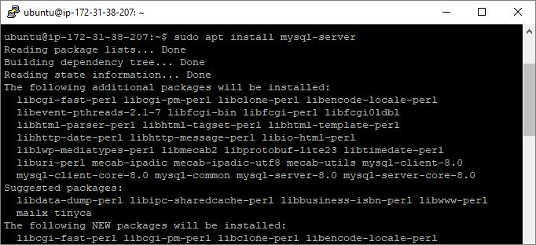

## Documentation of my First Project

1. **Installing Apache and updating the firewall**: After creating and logging into my instance via ssh, I ran the following commands:

    a. Update a list of packages in package manager

   - `sudo apt update`
     
     

    b. Install Apache
   - `sudo apt install apache2`
     
      

    c. Verify the status of Apache2 to see if it is running.
   - `sudo systemctl status apache2`
   
      

   d. Check local access to web through the local host
   - `curl http://localhost:80`
  
      

   e. Check web access from internet through the firewall

   - `http://3.22.169.27:80`

      

1. **Installing mysql**: After installing Apache, install mysql to be able to store and manage data for your site in a relational database:

    a. Install mysql

   - `sudo apt install mysql-server`
     
     

    b. Log into mysql console

   - `sudo mysql-server`
     
     

   c. Run a script to remove some insecure default settings. Set user’s password as PassWord.1.

   - `ALTER USER 'root'@'localhost' IDENTIFIED WITH mysql_native_password BY 'PassWord.1';`
     
     

   d. Start the interactive script by running the command below

   - `sudo mysql_secure_installation`
     
     

