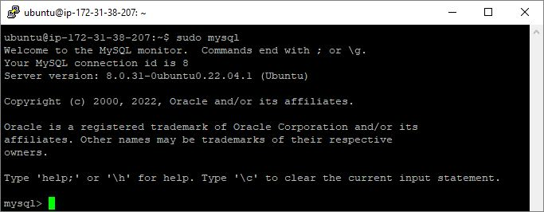
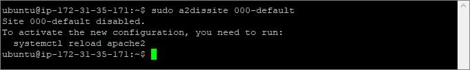

## DOCUMENTATION OF LAMP STACK IMPLEMENTATION - PROJECT 1
---
1. **Installing Apache and updating the firewall**: After creating and logging into my instance via ssh, I ran the following commands:

   a. Update a list of packages in package manager

   - `sudo apt update`

     

   b. Install Apache

   - `sudo apt install apache2`

     

   c. Verify the status of Apache2 to see if it is running.

   - `sudo systemctl status apache2`

     

   d. Check local access to web through the local host

   - `curl http://localhost:80`

     

   e. Check web access from internet through the firewall

   - `http://3.22.169.27:80`

     

1. **Installing mysql**: After installing Apache, install mysql to be able to store and manage data for your site in a relational database:

   a. Install mysql

   - `sudo apt install mysql-server`

     

   b. Log into mysql console

   - `sudo mysql`

     

   c. Run a script to remove some insecure default settings. Set user’s password as PassWord.1.

   - `ALTER USER 'root'@'localhost' IDENTIFIED WITH mysql_native_password BY 'PassWord.1';`

     

   d. Start the interactive script by running the command below

   - `sudo mysql_secure_installation`

     

   e. Test login to mysql-server using the command below

   - `sudo mysql -p`

     

1. **Installing php**: After installing Apache to serve your content and MySql installed to store and manage data, install php which is the componet required to process code to display dynamic content to the end user.

   a. Install the dependencies required for php to communicate with mysql and apache

   - `sudo apt install php libapache2-mod-php php-mysql`

     

    b. Confirm php version

   - `php -v`

     

1. **Creating a virtual host**: Create a virtual host for your website using apache using aufora as your domain name.

   a. Create directory for aufora using 'mkdir' command as follows

   - `sudo mkdir /var/www/aufora`

     

   b. Assign ownership of directory with the current user

   - `sudo chown -R $USER:$USER /var/www/aufora`

     

   c. Create and open a new config file in Apache's `sites available` directory using vim editor

   - `sudo vi /etc/apache2/sites-available/aufora.conf`

   - Paste the folowing in the snippet below

     

   d. Confirm the new file in the sites-available directory

   - `sudo ls /etc/apache2/sites-available`

     

   e. Enable the virtual host using the `a2ensite` command

   - `sudo a2ensite aufora`

     

   f. Disable Apache default website using the `a2dissite` command

   - `sudo a2dissite 000-default`

     

   g. To ensure the configuration file does not contain syntax errors, run:

   - `sudo a2dissite 000-default`

     

   h. Reload Apache for changes to take effect

   - `sudo systemctl reload apache2`

     

   i. Create an index.html file in that location in order to test the virtual host

   - `sudo echo 'Hello LAMP from hostname created by Mervin' $(curl -s http://169.254.169.254/latest/meta-data/public-hostname) 'with public IP' $(curl -s http://169.254.169.254/latest/meta-data/public-ipv4) > /var/www/aufora/index.html`

     

   j. Launch the new website using the public IP

   - `http://18.223.23.80`

     

   j. Launch the new website using the public DNS

   - `http://ec2-18-223-23-80.us-east-2.compute.amazonaws.com/`

     

1. **Enable PHP on the website**: With the default DirectoryIndex settings on Apache, a file named `index.html` will always take precedence over an `index.php` file. `index.html` is useful for temporary/maintenance page. 

   a. Change the behavior by editing the `/etc/apache2/mods-enabled/dir.conf` file and change the order in which the `index.php` file is listed within the DirectoryIndex directive:

   - `sudo vim /etc/apache2/mods-enabled/dir.conf`
   - Replace information in the below snippet with information in the next 

     
      

   b. Reload Apache for changes to take effect

   - `sudo systemctl reload apache2`

     

   c. Create index.php file in the web root folder

   - `sudo vim /var/www/aufora/index.php`

   d. Add the following PHP code and save

   - `<?php`

     `phpinfo();`  

     

   e. Refresh the webpages opened using public IP and public DNS

   - `http://18.223.23.80` and `http://ec2-18-223-23-80.us-east-2.compute.amazonaws.com/`

     
