**LOAD BALANCER SOLUTION WITH NGINX AND SSL/TLS - PROJECT 10**
___
In this project we will configure an `Nginx` Load Balancer solution. 

It is also extremely important to ensure that connections to your Web solutions are secure and information is `encrypted in transit` – we will also cover connection over secured `HTTP` (`HTTPS protocol`), its purpose and what is required to implement it.

When data is moving between a client (browser) and a Web Server over the Internet – it passes through multiple network devices and, if the data is not encrypted, it can be relatively easy intercepted by someone who has access to the intermediate equipment. This kind of information security threat is called `Man-In-The-Middle` (`MIMT`) attack.

This threat is real – users that share sensitive information (bank details, social media access credentials, etc.) via non-secured channels, risk their data to be compromised and used by `cybercriminals`.

`SSL` and its newer version, `TSL` – is a security technology that protects connection from MITM attacks by creating an encrypted session between browser and Web server. Here we will refer this family of `cryptographic` protocols as `SSL/TLS` – even though `SSL` was replaced by `TLS`, the term is still being widely used.

SSL/TLS uses `digital certificates` to identify and validate a Website. A browser reads the certificate issued by a `Certificate Authority` (`CA`) to make sure that the website is registered in the `CA` so it can be trusted to establish a secured connection.

**TASK**

This project consists of three parts:

1. Install and configure `Nginx` Server.
2. Register a new domain name and configure secured connection using `SSL/TLS` certificates.
3. Configure Nginx as a Load Balancer.

The target architecture will look like this:

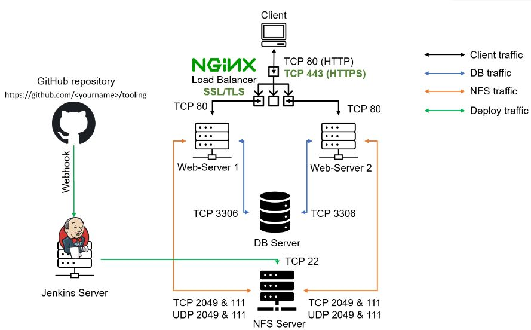

**STEP 1 - INSTALL AND CONFIGURE NGINX SERVER**

1. Create an EC2 VM based on Ubuntu Server 20.04 LTS and name it `Nginx LB` (do not forget to open TCP port 80 for HTTP connections, also open TCP port **443** – this port is used for secured HTTPS connections).

2. Update /etc/hosts file for local DNS with Web Servers’ names (e.g. `Web1` and `Web2`) and their local IP addresses.

   - `sudo vi /etc/hosts`

     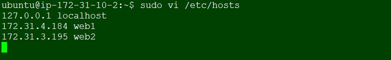

3. Update the instance and Install `Nginx`

   - `sudo apt update`
   - `sudo apt install nginx -y`

     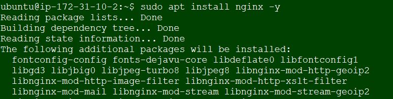

4. Configure` Nginx LB` using Web Servers’ names defined in `/etc/hosts`, open the default `nginx` configuration file and insert the code below:

   - `sudo vi /etc/nginx/nginx.conf`

        ```py
        #insert following configuration into http section

        upstream myproject {
           server Web1 weight=5;
           server Web2 weight=5;
         }

        server {
            listen 80;
            server_name www.domain.com;
            location / {
              proxy_pass http://myproject;
            }
         }

        #comment out this line
        #       include /etc/nginx/sites-enabled/*;
        ```

        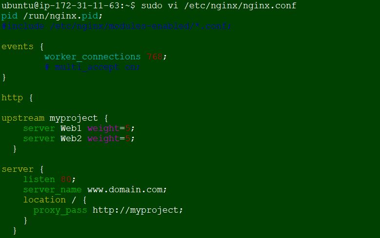

5. Restart Nginx and make sure the service is up and running.

    - `sudo systemctl restart nginx`
    - `sudo systemctl status nginx`
    
      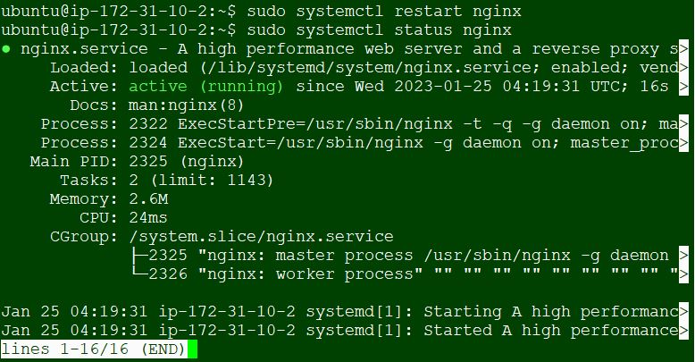

**STEP 2 - REGISTER A NEW DOMAIN NAME AND CONFIGURE SECURED CONNECTION USING SSL/TLS CERTIFICATES**

1. Purcahse a domain name. We will use `mervintec.com` for this project obtained from `namecheap`.

2. Setup `DNS` required to respond to `DNS` queries for our domain name. 

   - On `AWS` console, search and navigate to `ROUTE 53` dashboard. Under **DNS management** click `Create hosted zone`.

     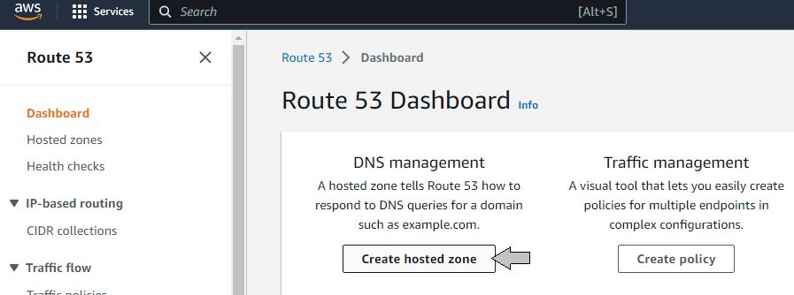

3. Update the Hosted zone configuration page.

    - On the **Domain name field**, enter `mervintec.com`, which is our domain name for this project.
    - Select **Public hosted zone** 
    - Click `Create hosted zone`.

      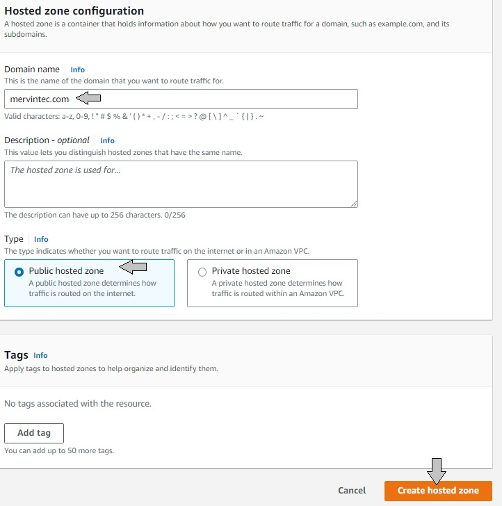

4. Write down the entries under **Value/Route traffic**. This is required to update the `Name Servers` on your `domain` host panel.

   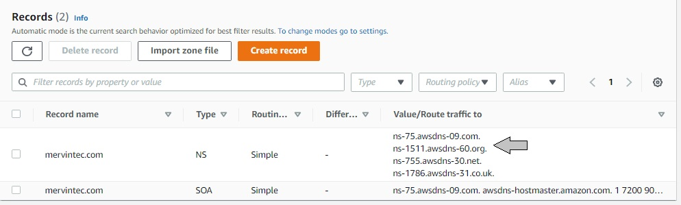

5. Logon to your `domain` host panel. (This process may differ from other domain registrar) 

      - Select your `domain` name 
      - Click `manage` 

        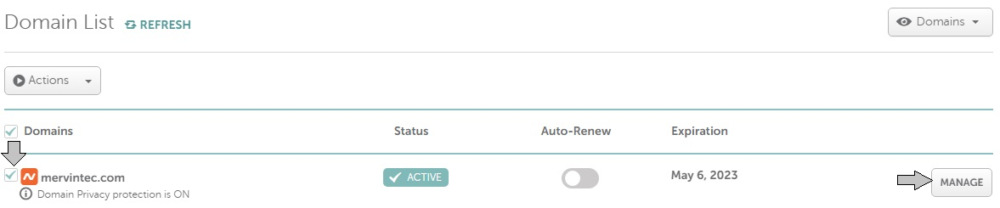

6. On the management panel
    - Navigate to `NAMESERVERS`
    - Select `Custom DNS`

      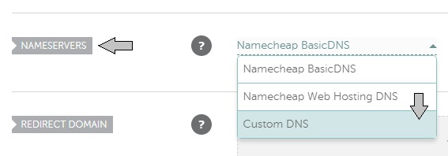

7. On the Custom `DNS`.
    - Update the entries with `ROUTE 53` Values on `Step 4`.
    - Click the green check button to save entries.

      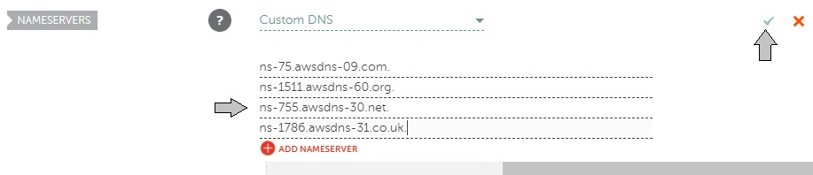

8. We need to create records under the **Hosted zone details**.

    - Click `Create record`

      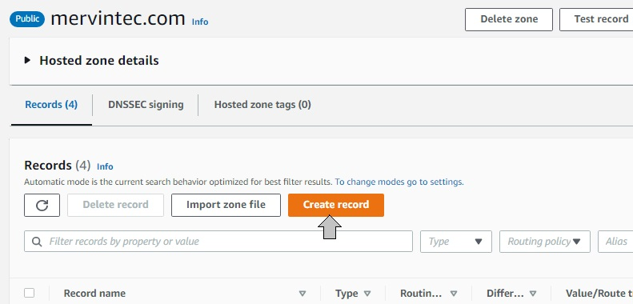

    - In **Value** filed, enter the nginx public IP address.
    - Click `Create records`

      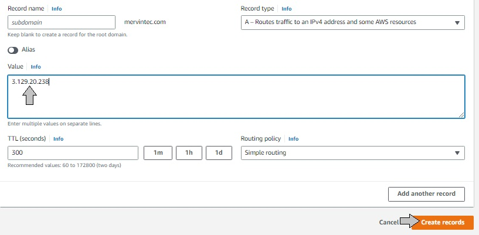

    - Click `Create record` on **Hosted zone details**

    - In **Record name** filed, enter `www`

    - In **Value** filed, enter the `nginx` public IP address.

    - Click `Create records`

      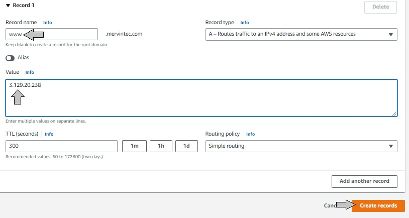

9. Check that the `nginx` Web interface can be reached from your browser using new domain name using `HTTP` protocol.

    - `http://<your-domain-name.com>`

      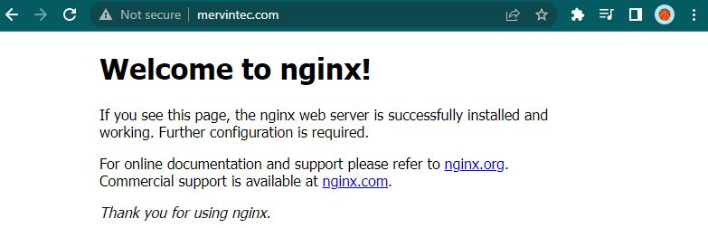


10. Let us update `nginx.conf` with `server_name www.<your-domain-name.com>` instead of `server_name www.domain.com` so that `Nginx` will recognize the new `domain` name.

    - `sudo vi /etc/nginx/nginx.conf`
    - Replace `server_name www.domain.com` with `server_name www.<your-domain-name.com>`

      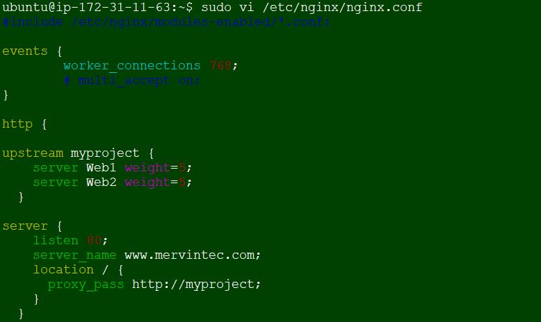

11. Confirm `snapd` service is active and running. `snapd` is a command-line interface tool used to install and manage snaps on a Linux system.

    - `sudo systemctl status snapd`

      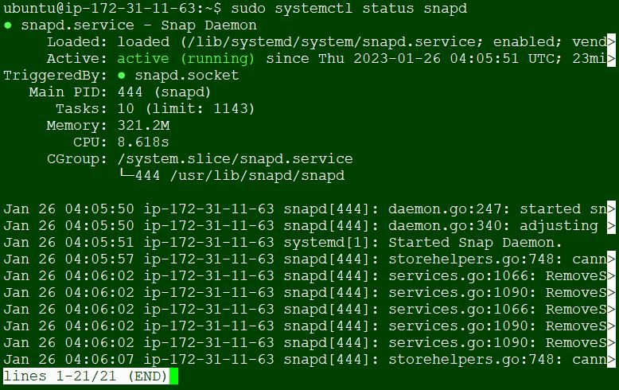

12. Update the hosts file with domain name and external IP and then install `certbot`.

    - `sudo vi /etc/hosts`

      

     - `sudo snap install --classic certbot`

       

13. Request for certificate (just follow the `certbot` instructions – you will need to choose which `domain` you want your certificate to be issued for, domain name will be looked up from `nginx.conf` file so make sure you have updated it on step 10).

    - `sudo ln -s /snap/bin/certbot /usr/bin/certbot`

    - `sudo certbot --nginx`

      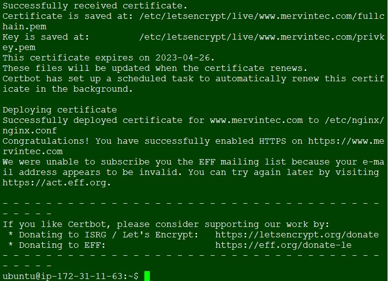

14. Test secured access to your Web Solution by trying to reach `https://<your-domain-name.com>`

    - `https://<your-domain-name.com>`

      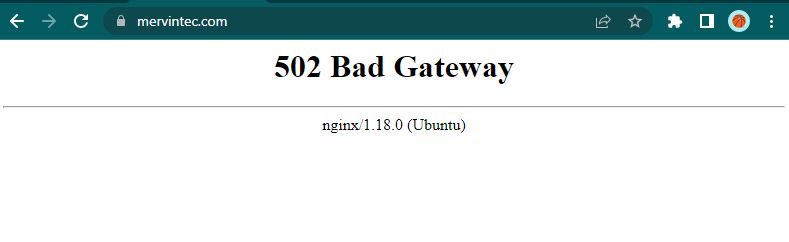

15. On your browser:

    - Click on the `padlock` icon and you can see the details of the certificate issued for your website.

       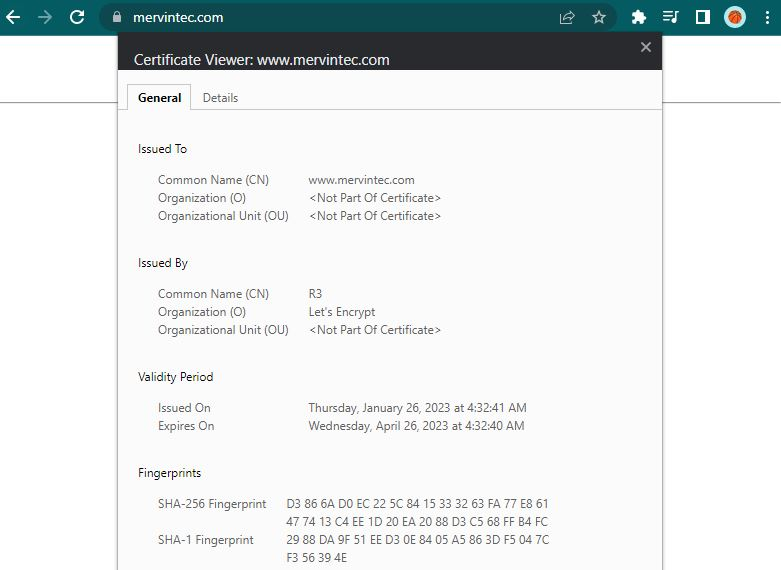

16. Set up periodical renewal of the SSL/TLS certificate. By default, LetsEncrypt certificate is valid for 90 days, so it is recommended to renew it at least every 60 days or more frequently. You can test renewal command in `dry-run` mode.

    - `sudo certbot renew --dry-run`

        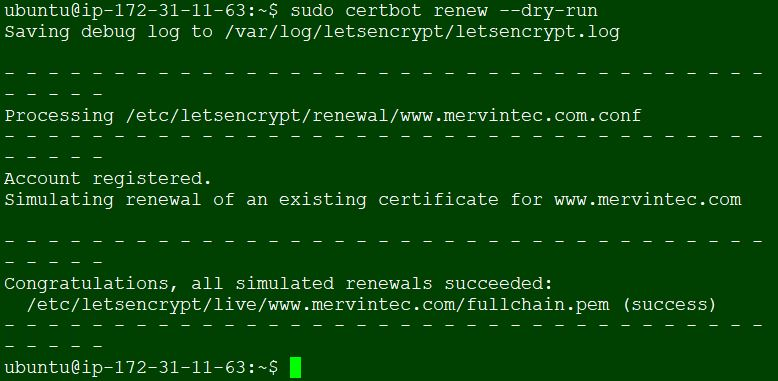

17. Best pracice is to have a scheduled job that to run `renew` command periodically. Let us configure a `cronjob` to run the command twice a day.

    To do so, lets edit the `crontab` file with the following command:

    - `crontab -e`
    - Select `1`
    - Add the following line below and save
      ```py
      * */12 * * *   root /usr/bin/certbot renew > /dev/null 2>&1
      ```

        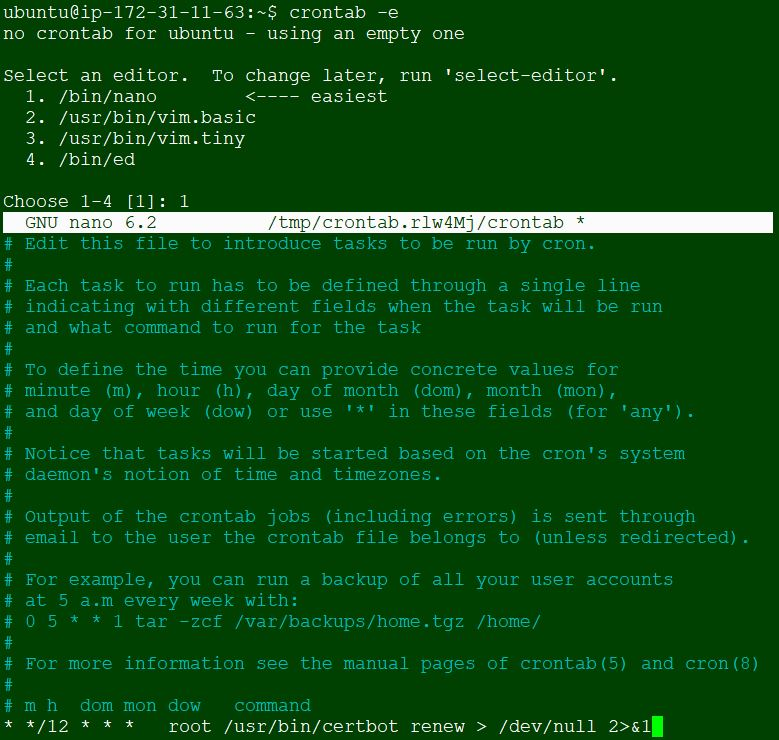

     You can always change the interval of this cronjob if twice a day is too often by adjusting schedule expression.

**STEP 2 - CONFIGURE NGINX AS A LOAD BALANCER**

1. Create a config file in sites-available with the `nginx` directory and paste the script below.

   - `sudo nano /etc/nginx/sites-available/load_balancer.conf`

     ```py
       upstream web {
           server Web1 weight=5;
           server Web2 weight=5;
         }

       server {
           listen 80;
           server_name <your-domain-name.com> <www.your-domain-name.com>;
           location / {
      
             proxy_set_header X-Forwarded-For $proxy_add_x_forwarded_for;
             proxy_pass http://web;
           }
         }
     ```
      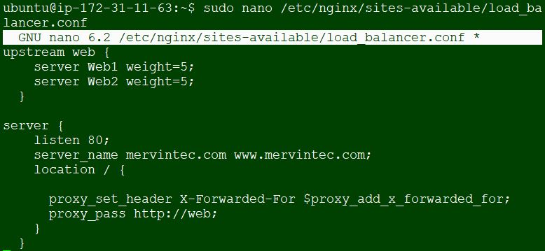

2. Remove `nginx` default site so that the reverse proxy will redirect to the new config file and also run `sudo nginx -t` to check if `nginx` is configured successfully

   - `sudo rm -f /etc/nginx/sites-enabled/default`

   - `sudo nginx -t`

     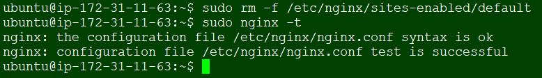

3. Navigate to `/etc/nginx/sites-enabled` and ensure that there is no file there.
  
   - `cd /etc/nginx/sites-enabled`
   - `ls`

     

4. Link the newly created Load balancer config file created in sites-available to sites-enabled and also confirm that `load_balancer.conf` has been linked by using `ll` command which will show us the link arrow. Also reload `nginx`.

   - `sudo ln -s ../sites-available/load_balancer.conf .`

     **Note**: ln = link, -s = symbolic link between `sites-enabled` and `sites-available`, "`.`" = move everything into `sites-enabled` location.

   - `ls`

   - `sudo systemctl reload nginx`

     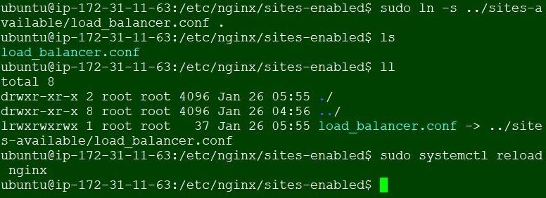

5. Check that the Web Servers can be reached from your browser using the new `domain` name with `HTTPS` protocol – https://`<your-domain-name.com>`.

   - `https://<your-domain-name.com>`

     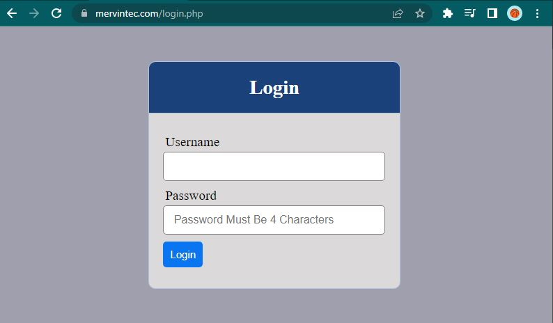