**POROJECT 11 - ANSIBLE CONFIGURATION MANAGEMENT - AUTOMATE PROJECT 7 - 10**
___
In Projects 7 to 10 you had to perform a lot of manual operations to seet up virtual servers, install and configure required software, deploy your web application. 

In this Project we will automate most of the routine tasks with **Ansible Configuration Management** using declarative languahe such as `yaml`.

We will use Ansible Client as a `Jump Server` (`Bastion Host`). Invariably a `Jump Server` is an intermediary server through which access to internal network can be provided. If you think about the current architecture you are working on, ideally, the webservers would be inside a secured network which cannot be reached directly from the Internet. That means, even DevOps engineers cannot `SSH` into the Web servers directly and can only access it through a `Jump Server` – it provide better security and reduces attack surface.

On the diagram below the **Virtual Private Network** (VPC) is divided into two subnets – Public subnet has public IP addresses and Private subnet is only reachable by private IP addresses.

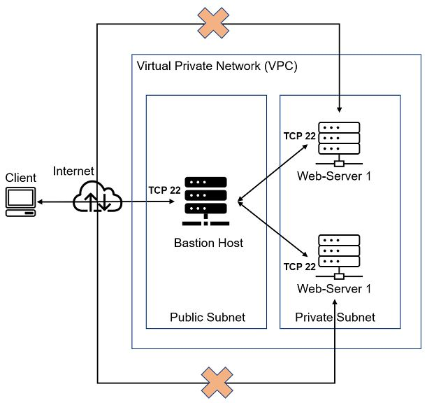

**TASK**

1. Install and configure Ansible client to act as a Jump Server/Bastion Host.
2. Create a simple Ansible playbook to automate servers configuration.


**STEP 1 - INSTALL AND CONFIGURE ANSIBLE ON EC2 INSTANCE**

1. Update `Name` tag on your `Jenkins` EC2 Instance to `Jenkins-Ansible`. We will use this server to run playbooks.

2. In your GitHub account create a new repository and name it `ansible-config-mgt`.

   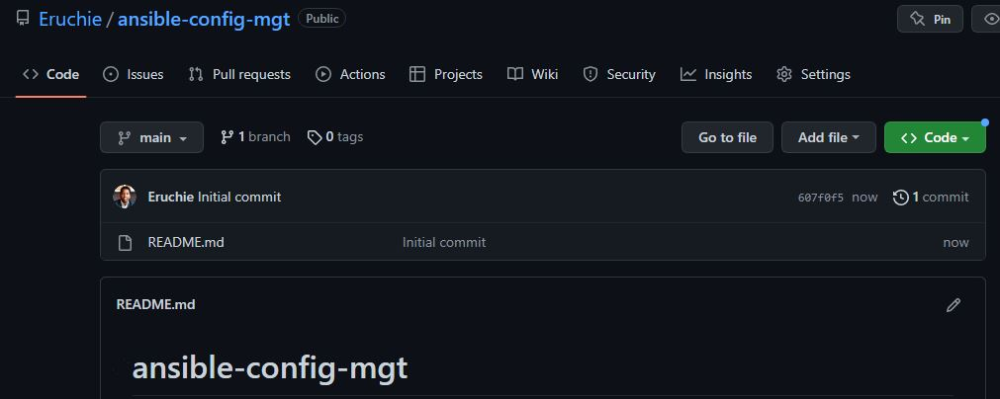

3. Instal `Ansible` and check the version.

   - `sudo apt update`
   - `sudo apt install ansible -y`

     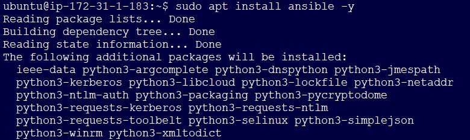

   - `ansible --version`

     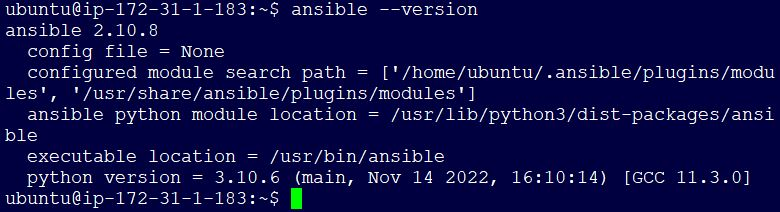

4. Configure Jenkins build job to save your repository content every time you change it (Remember to update the public IP in `Jenkins` console). Refer to `Project 9` for detailed guide: 

   a. Create a new Freestyle project `ansible` in Jenkins dashboard and point it to your ‘ansible-config-mgt’ repository.

   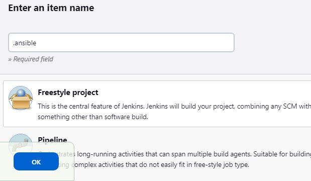

   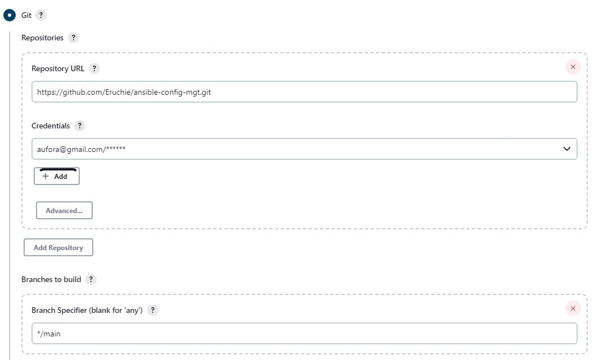

   b. Configure `Webhook` in `ansible-config-mgt` repo and set it to trigger `ansible` build.

   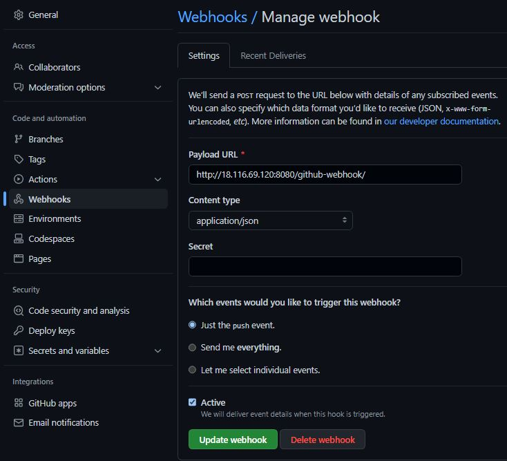

   c. Configure a Post-build job to save all (`**`) files, like you did it in `Project 9`.

   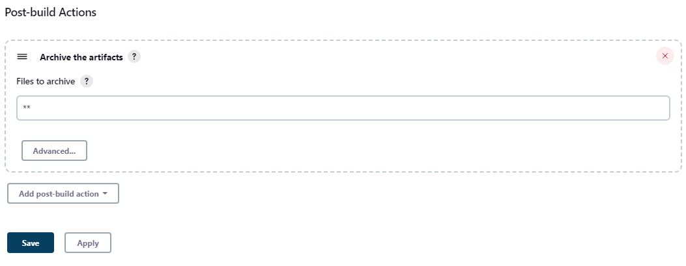

   d. Test and confirm the build.

   

   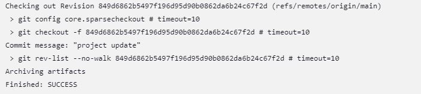

   e. Test your setup by making some change in `README.MD` file in `main` branch and make sure that builds starts automatically and Jenkins saves the files (build artifacts) in following folder (ensure to select the build number)

   - `ls /var/lib/jenkins/jobs/ansible/builds/<build_number>/archive/`

     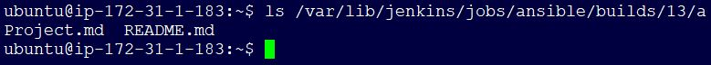

The setup will now look like this:

   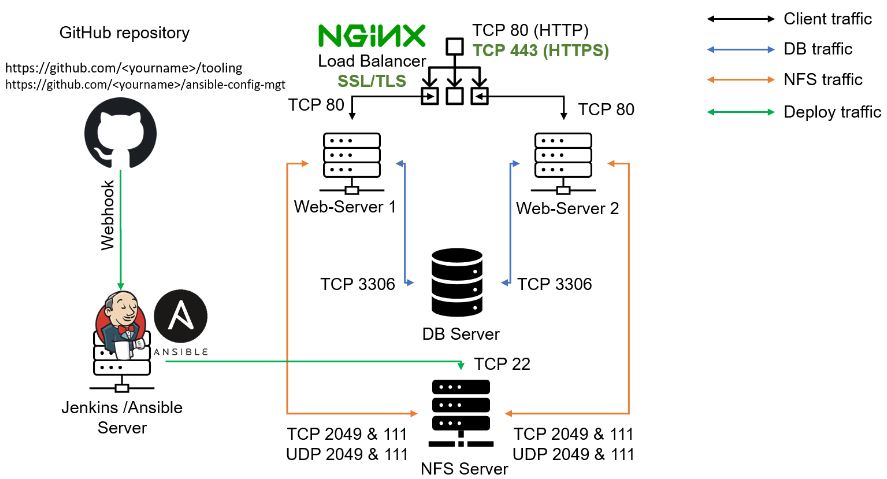

**STEP 2 - PREPARE THE DEVELOPMENT ENVIROMENT USING VISUAL STUDIO CODE**

1. On your VSCode, clone down the `ansible-config-mgt` repo to your Jenkins-Ansible instance.

   - `git clone <ansible-config-mgt repo link>`

     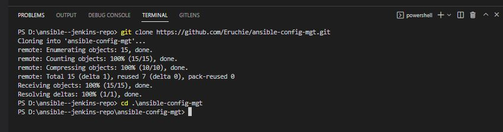

**STEP 3 - BEGIN ANSIBLE DEVELOPMENT**

1. In the `ansible-config-mgt` GitHub repository, create a new branch that will be used for development of a new feature.

   - `git branch dev/prj-11-ans`

2. Checkout the newly created feature branch to your local machine and start building your code and directory structure.

   - `git checkout dev/prj-11-ans`

     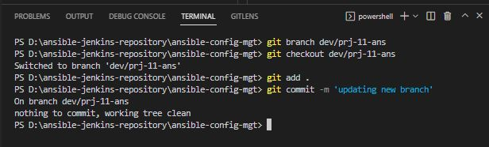

3. Create a directory and name it `playbooks` – it will be used to store all THE playbook files.

4. Create a directory and name it `inventory` – it will be used to keep your hosts organised.

5. Within the playbooks folder, create a playbook, and name it` common.yml`.

6. Within the inventory folder, create an inventory file (.yml) for each environment (Development, Staging Testing and Production) `dev`, `staging`, `uat`, and `prod` respectively.

      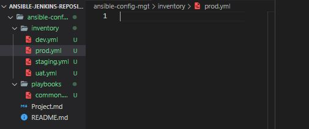

**STEP 4 - SETUP ANSIBLE INVENTORY**

An `Ansible inventory` file defines the hosts and groups of hosts upon which commands, modules, and tasks in a playbook operate. Since our intention is to execute Linux commands on remote hosts, and ensure that it is the intended configuration on a particular server that occurs, It is important to have a way to organize our hosts in such an Inventory.

`Ansible` uses TCP port 22 by default, which means it needs to `ssh` into target servers from `Jenkins-Ansible` host – for this you can implement the concept of **ssh-agent**. You need to import your key into `ssh-agent`.

Use the steps below to setup SSH agent and connect VS Code to your Jenkins-Ansible instance with `git bash`.

1. To make sure that OpenSSH is available, run the following cmdlet:

   - `(New-Object Security.Principal.WindowsPrincipal([Security.Principal.WindowsIdentity]::GetCurrent())).IsInRole([Security.Principal.WindowsBuiltInRole]::Administrator)`

     

2. Install the server or client components as needed:

   **# Install the OpenSSH Client**

   - `Add-WindowsCapability -Online -Name OpenSSH.Client~~~~0.0.1.0`

   **# Install the OpenSSH Server**

   - `Add-WindowsCapability -Online -Name OpenSSH.Server~~~~0.0.1.0`

     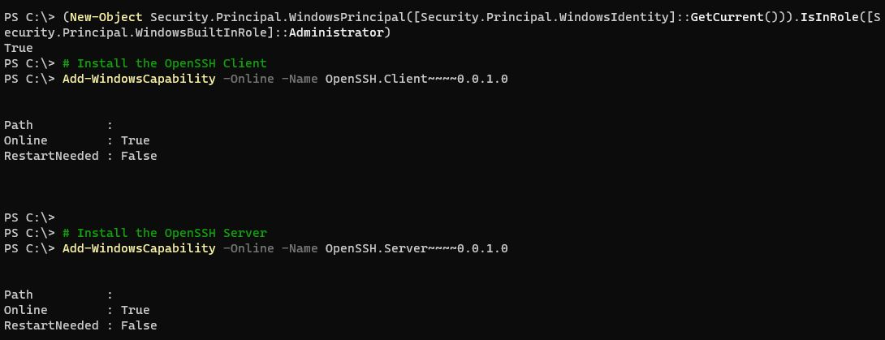

3. Run the following commands to start the `sshd service`:

   ```py
   # Start the sshd service
   Start-Service sshd

   # OPTIONAL but recommended:
   Set-Service -Name sshd -StartupType 'Automatic'

   # Confirm the Firewall rule is configured. It should be created automatically by setup. Run the following to verify
   if (!(Get-NetFirewallRule -Name "OpenSSH-Server-In-TCP" -ErrorAction SilentlyContinue | Select-Object Name, Enabled)) {
      Write-Output "Firewall Rule 'OpenSSH-Server-In-TCP' does not exist, creating it..."
      New-NetFirewallRule -Name 'OpenSSH-Server-In-TCP' -DisplayName 'OpenSSH Server (sshd)' -Enabled True -Direction Inbound -Protocol TCP -Action Allow -LocalPort 22
   } else {
      Write-Output "Firewall rule 'OpenSSH-Server-In-TCP' has been created and exists."
   }
   ```
   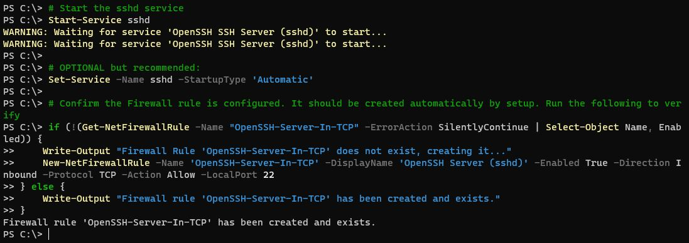

4. By default the sshd service is set to start manually. To start it each time the server is rebooted, run the following commands from an elevated PowerShell prompt on your system:

   **# Set the sshd service to be started automatically**

   - `Get-Service -Name sshd | Set-Service -StartupType Automatic`

   **# Now start the sshd service**

   - `Start-Service sshd`

      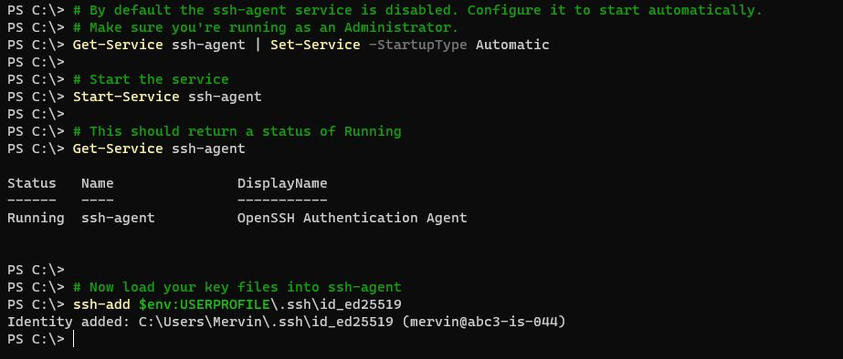

5. To use key-based authentication, you first need to generate public/private key pairs for your client. ssh-keygen.exe is used to generate key files and the algorithms DSA, RSA, ECDSA, or Ed25519 can be specified. If no algorithm is specified, RSA is used. A strong algorithm and key length should be used, such as Ed25519 in this example.

   To generate key files using the `Ed25519` algorithm, run the following command from a PowerShell or cmd prompt on your client:

   - `ssh-keygen -t ed25519`

     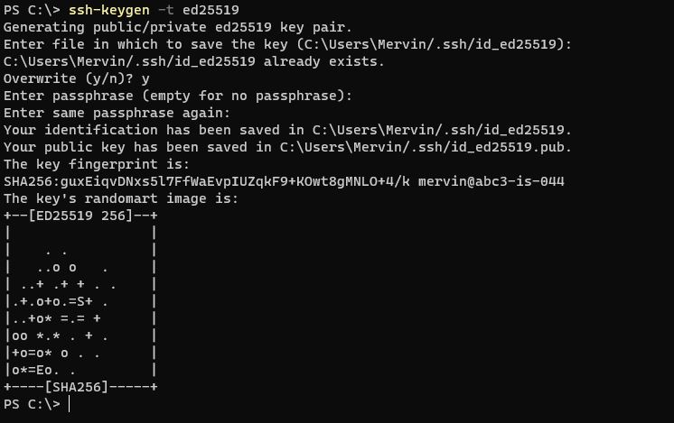

6. On **VSCode** open `git bash` and run the commands below (ensure you have the `.pem file`/`keypair` for your `EC2` instances):

   - eval `ssh-agent -s`
   - `ssh-add <path-to-private-key>`

   Confirm the key has been added with the command below, you should see the name of your key.

   - `ssh-add -l`

     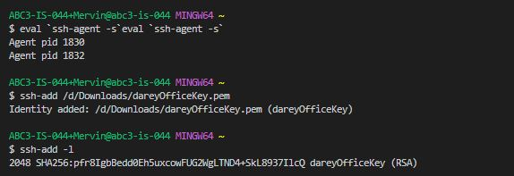

7. Now, ssh into the `Jenkins-Ansible` server, which serves as the `bastion host`, using ssh-agent

   - `ssh -A ubuntu@public-ip`
   
     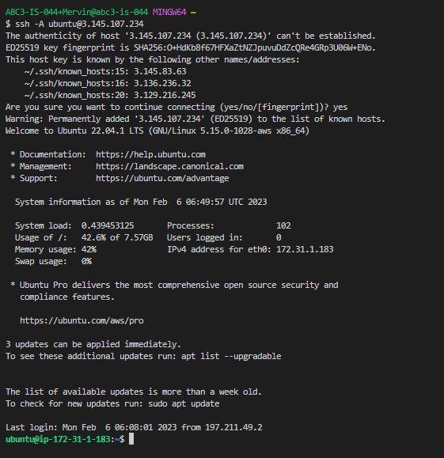

8. Ensure you can ssh to other servers seemlessly (user is `ubuntu` and user for RHEL-based servers is `ec2-user`).

   - `ssh ubuntu@private-ip` for ubuntu server
   - `ssh ec2-user@private-ip` for RHEL-based servers
   
     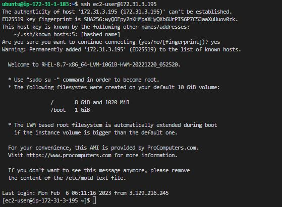

9. Update the inventory/dev.yml file with this snippet of code:

   ```yml
   [nfs]
   <NFS-Server-Private-IP-Address> ansible_ssh_user='ec2-user'

   [webservers]
   <Web-Server1-Private-IP-Address> ansible_ssh_user='ec2-user'
   <Web-Server2-Private-IP-Address> ansible_ssh_user='ec2-user'

   [db]
   <Database-Private-IP-Address> ansible_ssh_user='ec2-user' 

   [lb]
   <Load-Balancer-Private-IP-Address> ansible_ssh_user='ubuntu'
   ```
   
     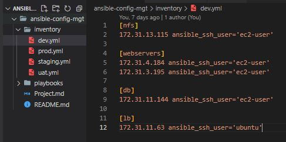


**STEP 5 - CREATE A COMMON PLAYBOOK**

Create a `playbook` containing set of instructions on what should be performed on all servers listed in `inventory/dev`.

In `common.yml` playbook, write a configuration for repeatable, re-usable, and multi-machine tasks that is common to systems within the infrastructure.

1. Update the `playbooks/common.yml` file with following code:

   ```yml
   ---
   - name: update web, nfs and db servers
   hosts: webservers, nfs, db
   remote_user: ec2-user
   become: yes
   become_user: root
   tasks:
      - name: ensure wireshark is at the latest version
         yum:
         name: wireshark
         state: latest

   - name: update LB server
   hosts: lb
   remote_user: ubuntu
   become: yes
   become_user: root
   tasks:
      - name: Update apt repo
         apt: 
         update_cache: yes

      - name: ensure wireshark is at the latest version
         apt:
         name: wireshark
         state: latest
   ```
   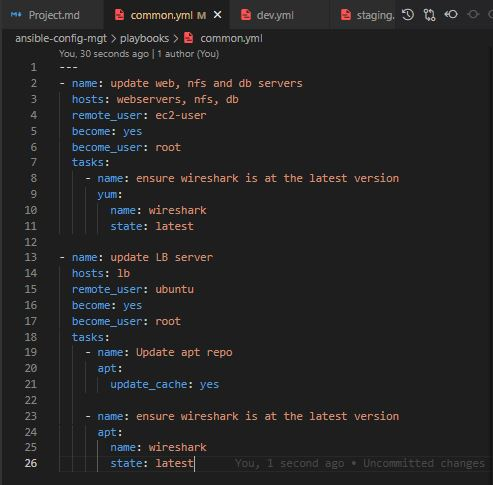

   The playbook is divided into two parts, each of them is intended to perform the same task: install `wireshark` utility (or make sure it is updated to the latest version) on the RHEL 8 and Ubuntu servers. It uses root user to perform this task and respective package manager: `yum` for RHEL 8 and `apt` for Ubuntu.

**STEP 6 - UPDATE GIT WITH THE LATEST CODE**

All the directories and files now reside on the local machine and we need to push changes made locally to GitHub.

Best practice ensures that codes are reviewed before deployment to production.

Now we have a separate branch, we will need to know how to raise a **Pull Request (PR)**, get your branch peer reviewed and merged to the `main` branch.

1. Use git commands to add, commit and push your branch to GitHub.

   - `git status`
   - `git add <selected files>`
   - `git commit -m "commit message"`
   - `git push origin <name of the working branch>`

     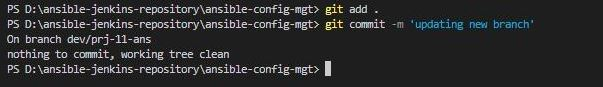

2. After reviewing the new development on our feature branch to satisfactory, create a Pull request (PR) on `ansible-config-mgt` git repo.
   - On code tab, click `Compare and pull request`.

     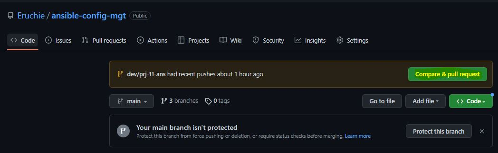

   - Click `Create pull request`.

     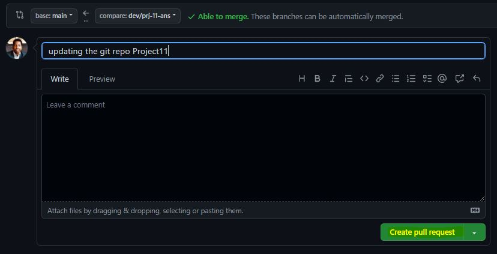

   - Click `Merge pull request`.

     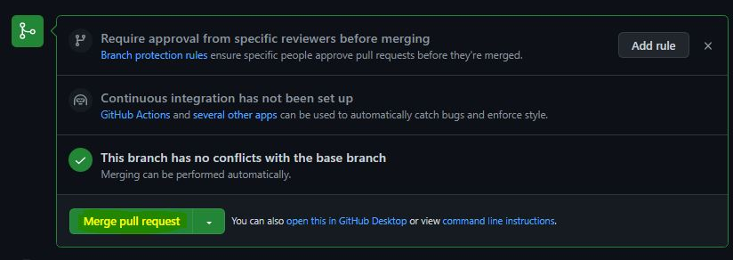

   - Click `Confirm merge`.

     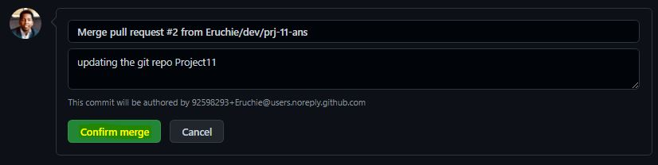

   - Click `Confirm merge`.

     

3. Check the build history on `Jenkins`.

   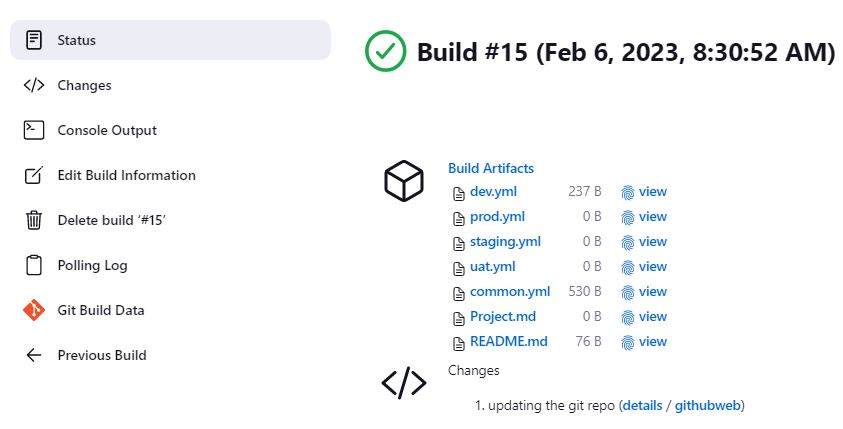

4. Check if the files are located in the folder `playbooks` (ensure to select the build number) and cat into common.yml to see if it is updated. 

   - `ls /var/lib/jenkins/jobs/ansible/builds/<build_number>/archive/directory on jenkins-ansible server`

     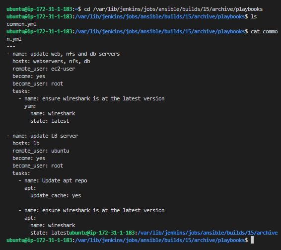

5. On our local machine/terminal, checkout from the feature branch into the main branch, and pull down the latest changes. 

   - `git checkout main`
   - `git pull`

     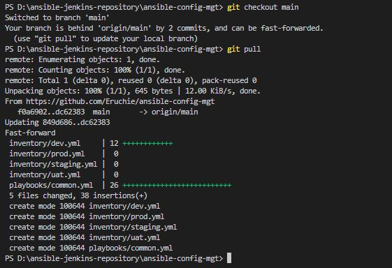

**STEP 7 - RUN ANSIBLE FIRST TEST**

Now, it is time to execute `ansible-playbook` command and verify if your playbook actually works:

1. On the bastion/Jenkins-Ansible server, run the command

   - `ansible-playbook -i /var/lib/jenkins/jobs/ansible/builds/<build_number>/archive/inventory.dev.yml /var/lib/jenkins/jobs/ansible/builds/<build_number>/archive/playbooks/common.yml`
 
     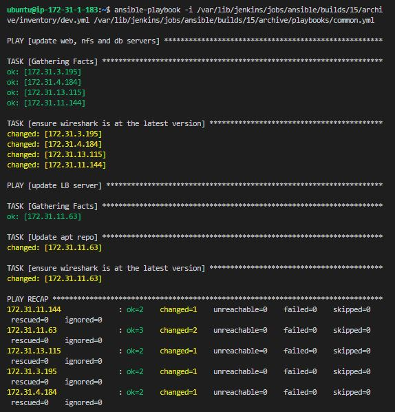

2. Confirm `wireshark` installation and version by connecting to a webserver from the bastion host via `ssh`.

    - `ssh ec2-user@<web-server-private-IP>`
    - `which wireshark`
    - `wireshark --version`

      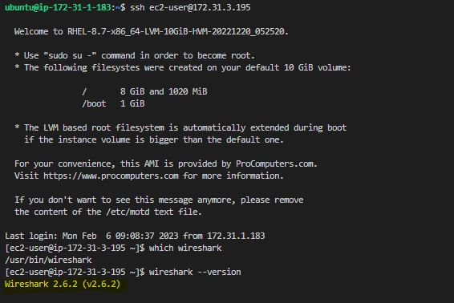

3. Checkout to `dev/prj-11-ans`, create a new file common2.yml in playbooks directory and update it with the following snippet required to create a folder `darey_prj11` under the path `/etc`.

   ```yml
   ---
   - name: Create dir on web, nfs and db servers
   hosts: webservers, nfs, db
   remote_user: ec2-user
   become: yes
   become_user: root
   tasks:
      - name: Create a directory if it does not exist
         ansible.builtin.file:
         path: /etc/darey_prj11
         state: directory
         mode: '0755'

   - name: update LB server
   hosts: lb
   remote_user: ubuntu
   become: yes
   become_user: root
   tasks:
      - name: Create a directory if it does not exist
         ansible.builtin.file:
         path: /etc/darey_prj11
         state: directory
         mode: '0755'
   ```
    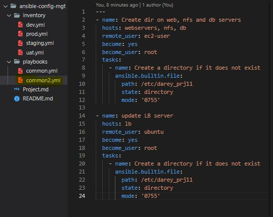
4. Create a Pull request (PR) on `ansible-config-mgt` git repo (refer to step 6 sections 2 and 5).

5. On the bastion/Jenkins-Ansible server, run the command:

   - `ansible-playbook -i /var/lib/jenkins/jobs/ansible/builds/<build_number>/archive/inventory.dev.yml /var/lib/jenkins/jobs/ansible/builds/<build_number>/archive/playbooks/common2.yml`
 
     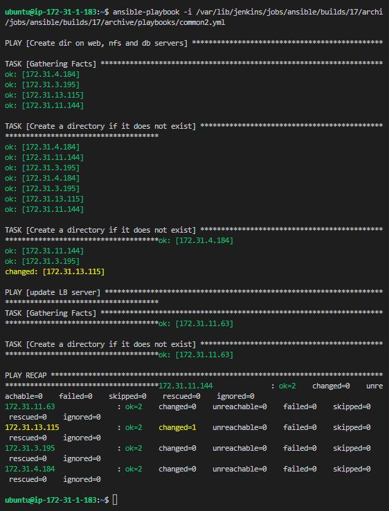

6. ssh into a web server and confirm the directory `darey_prj11` has been created.

    - `ssh ec2-user@<web-server-private-IP>`
    - `ls /etc`
    - `cd /etc/darey_prj11`
 
      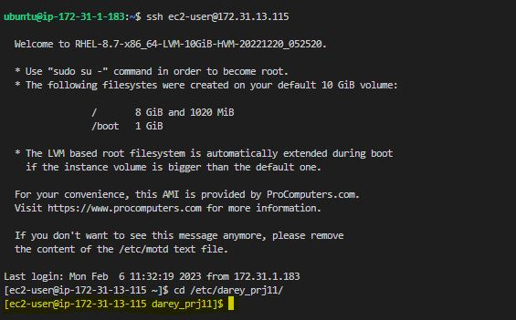