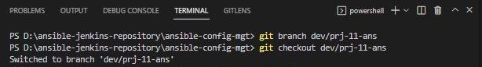
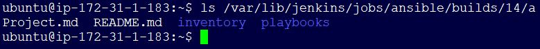
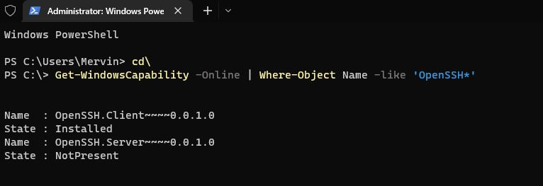

**POROJECT 11 - ANSIBLE CONFIGURATION MANAGEMENT - AUTOMATE PROJECT 7 - 10**
___
In Projects 7 to 10 you had to perform a lot of manual operations to seet up virtual servers, install and configure required software, deploy your web application. 

In this Project we will automate most of the routine tasks with **Ansible Configuration Management** using declarative languahe such as `yaml`.

We will use Ansible Client as a `Jump Server` (`Bastion Host`). Invariably a `Jump Server` is an intermediary server through which access to internal network can be provided. If you think about the current architecture you are working on, ideally, the webservers would be inside a secured network which cannot be reached directly from the Internet. That means, even DevOps engineers cannot `SSH` into the Web servers directly and can only access it through a `Jump Server` – it provide better security and reduces attack surface.

On the diagram below the **Virtual Private Network** (VPC) is divided into two subnets – Public subnet has public IP addresses and Private subnet is only reachable by private IP addresses.


**TASK**

1. Install and configure Ansible client to act as a Jump Server/Bastion Host.
2. Create a simple Ansible playbook to automate servers configuration.


**STEP 1 - INSTALL AND CONFIGURE ANSIBLE ON EC2 INSTANCE**

1. Update `Name` tag on your `Jenkins` EC2 Instance to `Jenkins-Ansible`. We will use this server to run playbooks.

2. In your GitHub account create a new repository and name it `ansible-config-mgt`.

   

3. Instal `Ansible` and check the version.

   - `sudo apt update`
   - `sudo apt install ansible -y`

     

   - `ansible --version`

     

4. Configure Jenkins build job to save your repository content every time you change it (Remember to update the public IP in `Jenkins` console). Refer to `Project 9` for detailed guide: 

   a. Create a new Freestyle project `ansible` in Jenkins dashboard and point it to your ‘ansible-config-mgt’ repository.

   

   

   b. Configure `Webhook` in `ansible-config-mgt` repo and set it to trigger `ansible` build.

   

   c. Configure a Post-build job to save all (`**`) files, like you did it in `Project 9`.

   

   d. Test and confirm the build.

   

   

   e. Test your setup by making some change in `README.MD` file in `main` branch and make sure that builds starts automatically and Jenkins saves the files (build artifacts) in following folder (ensure to select the build number)

   - `ls /var/lib/jenkins/jobs/ansible/builds/<build_number>/archive/`

     

The setup will now look like this:

   

**STEP 2 - PREPARE THE DEVELOPMENT ENVIROMENT USING VISUAL STUDIO CODE**

1. On your VSCode, clone down the `ansible-config-mgt` repo to your Jenkins-Ansible instance.

   - `git clone <ansible-config-mgt repo link>`

     

**STEP 3 - BEGIN ANSIBLE DEVELOPMENT**

1. In the `ansible-config-mgt` GitHub repository, create a new branch that will be used for development of a new feature.

   - `git branch dev/prj-11-ans`

2. Checkout the newly created feature branch to your local machine and start building your code and directory structure.

   - `git checkout dev/prj-11-ans`

     

3. Create a directory and name it `playbooks` – it will be used to store all THE playbook files.

4. Create a directory and name it `inventory` – it will be used to keep your hosts organised.

5. Within the playbooks folder, create a playbook, and name it` common.yml`.

6. Within the inventory folder, create an inventory file (.yml) for each environment (Development, Staging Testing and Production) `dev`, `staging`, `uat`, and `prod` respectively.

      

7. Check the build history.

   

8. Check if the files (build artifacts) are located in following folder (ensure to select the build number)

   - `ls /var/lib/jenkins/jobs/ansible/builds/<build_number>/archive/`

     


**STEP 4 - SETUP ANSIBLE INVENTORY**

An `Ansible inventory` file defines the hosts and groups of hosts upon which commands, modules, and tasks in a playbook operate. Since our intention is to execute Linux commands on remote hosts, and ensure that it is the intended configuration on a particular server that occurs, It is important to have a way to organize our hosts in such an Inventory.

`Ansible` uses TCP port 22 by default, which means it needs to `ssh` into target servers from `Jenkins-Ansible` host – for this you can implement the concept of **ssh-agent**. You need to import your key into `ssh-agent`.

Use the following steps to setup SSH agent and connect VS Code to your Jenkins-Ansible instance on a **Windows** system.


1. Open powershell with adminsitrative priviledges. 

2. To make sure that OpenSSH is available, run the following cmdlet:

   - `(New-Object Security.Principal.WindowsPrincipal([Security.Principal.WindowsIdentity]::GetCurrent())).IsInRole([Security.Principal.WindowsBuiltInRole]::Administrator)`

     

3. Install the server or client components as needed:

   **# Install the OpenSSH Client**

   - `Add-WindowsCapability -Online -Name OpenSSH.Client~~~~0.0.1.0`

   **# Install the OpenSSH Server**

   - `Add-WindowsCapability -Online -Name OpenSSH.Server~~~~0.0.1.0`

     

4. Run the following commands to start the `sshd service`:

```py
  # Start the sshd service
  Start-Service sshd

  # OPTIONAL but recommended:
  Set-Service -Name sshd -StartupType 'Automatic'

  # Confirm the Firewall rule is configured. It should be created automatically by setup. Run the following to verify
  if (!(Get-NetFirewallRule -Name "OpenSSH-Server-In-TCP" -ErrorAction SilentlyContinue | Select-Object Name, Enabled)) {
    Write-Output "Firewall Rule 'OpenSSH-Server-In-TCP' does not exist, creating it..."
    New-NetFirewallRule -Name 'OpenSSH-Server-In-TCP' -DisplayName 'OpenSSH Server (sshd)' -Enabled True -Direction Inbound -Protocol TCP -Action Allow -LocalPort 22
  } else {
    Write-Output "Firewall rule 'OpenSSH-Server-In-TCP' has been created and exists."
  }
```


5. By default the sshd service is set to start manually. To start it each time the server is rebooted, run the following commands from an elevated PowerShell prompt on your system:

   **# Set the sshd service to be started automatically**

   - `Get-Service -Name sshd | Set-Service -StartupType Automatic`

   **# Now start the sshd service**

   - `Start-Service sshd`

     

6. To use key-based authentication, you first need to generate public/private key pairs for your client. ssh-keygen.exe is used to generate key files and the algorithms DSA, RSA, ECDSA, or Ed25519 can be specified. If no algorithm is specified, RSA is used. A strong algorithm and key length should be used, such as Ed25519 in this example.

   To generate key files using the `Ed25519` algorithm, run the following command from a PowerShell or cmd prompt on your client:

   - `ssh-keygen -t ed25519`

   