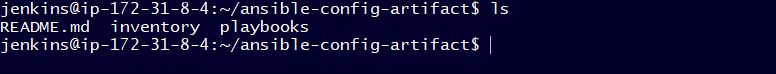

**POROJECT 12 - ANSIBLE REFACTORING AND STATIC ASSIGNMENTS (IMPORTS AND ROLES)**

---

In this project we will continue working with the `ansible-config-mgt` repository and make some improvements in the code.

We will refactor the Ansible code, create assignments, and learn how to use the `imports` functionality. Imports allow us effectively re-use previously created playbooks in a new playbook – it allows us organize tasks and reuse them when needed.

**CODE REFACTORING**

`Refactoring` is a general term in computer programming. It means making changes to the source code without changing expected behaviour of the software. The main idea of refactoring is to enhance code readability, increase maintainability and extensibility, reduce complexity, add proper comments without affecting the logic.

In this project, we will move things around a little bit in the code, but the overal state of the infrastructure remains the same.

**STEP 1 - JENKINS JOB ENHANCEMENT**
Every new change in the code create a separate directory which is not very convenient when we want to run some commands from one place. Also, it consumes space on `Jenkins` server with each subsequent change. Let us enhance it by introducing a new Jenkins project/job – we will require **Copy Artifact** plugin.

1. ssh to `Jenkins-Ansible` server, cd to the path `/var/lib/jenkins`. Switch account to jenkins user and create a new directory called `ansible-config-artifact` – this is where all the artifacts will be stored after each build.

   - `cd /var/lib/jenkins`
   - `sudo su jenkins`
   - `mkdir ansible-config-artifact`

     

2. Go to Jenkins web console -> Manage Jenkins -> Manage Plugins -> on `Available plugins` tab search for `Copy Artifact` and install this plugin without restarting Jenkins.

   

3. Create a new Freestyle project and name it `save_artifacts`. This project will be triggered by completion of your existing `ansible` project. Configure it accordingly:

   - Navigate to `save_artifacts` project, in the **General** section, check **Discard old builds** and ensure `Log Rotaion` is selected under **Strategy**. The **Max# of builds to keep** should be 2. You can configure number of builds to keep in order to save space on the server, for example, you might want to keep only last 2 or 5 build results. You can also make this change to the `ansible` job.

     

   - In the **Build Triggers** section, check **Build after other projects are built** and ensure `ansible` is selected under **Projects to watch**. Also, select the option **Trigger only if build is stable**.

     

4. The main idea of `save_artifacts` project is to save artifacts into `/home/ubuntu/ansible-config-artifact` directory. To achieve this, create a `Build` step and choose **Copy artifacts from other project**, specify ansible as a source project and /home/ubuntu/ansible-config-artifact as a target directory. Configure it accordingly:

   - In the **Build Steps** section, select **Copy artifacts from other project**. Under **Artifacts to copy** type `**` and on **Target Directory** type the path `/var/lib/jenkins/ansible-config-artifact` and then click **Save**.

     

5. Test your set up by making some change in README.MD file inside your `ansible-config-mgt` repository (right inside `main` branch).

   

6. If both Jenkins jobs have completed one after another – you shall see your files inside `/var/lib/jenkins/ansible-config-artifact` directory and it will be updated with every commit to your `main` branch.

   

**STEP 2 - REFACTOR ANSIBLE CODE BY IMPORTING OTHER PLAYBOOKS INTO SITE.YML**

Before starting to `refactor` the codes, ensure that you have pulled down the latest code from `main` branch, and created a new branch, name it `refactor`. Refactoring is one of the techniques that can be used to effect constant iterative improvement for better efficiency