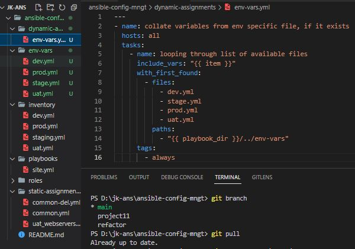
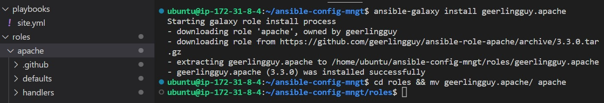
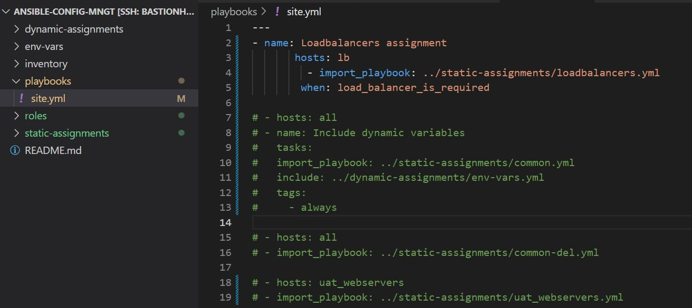

**POROJECT 13 - ANSIBLE DYNAMIC ASSIGNMENTS (INCLUDE) AND COMMUNITY ROLES**

---

Ansible is an actively developing software project, so you are encouraged to visit `Ansible` Documentation for the latest updates on modules and their usage.

The last Projects gave us hands on `Ansible` experience on how to perform configurations using `playbooks`, `roles` and `imports`.

**Project 13** will introduce *dynamic assignments* by using `include` module. From Project 12, we can  tell that *static assignments* use `import` Ansible module. The module that enables *dynamic assignments* is `include`.

    ```
    import = Static
    include = Dynamic
    ```
When the `import` module is used, all statements are pre-processed at the time playbooks are **parsed**. Meaning, when you execute `site.yml` playbook, Ansible will process all the playbooks referenced during the time it is parsing the statements. This also means that, during actual execution, if any statement changes, such statements will not be considered. Hence, it is `static`.

On the other hand, when `include` module is used, all statements are processed only during execution of the playbook. Meaning, after the statements are **parsed**, any changes to the statements encountered during execution will be used.

In most cases it is recommended to use `static` assignments for playbooks, because it is more reliable. With `dynamic` ones, it is hard to debug playbook problems due to its `dynamic` nature. However, you can use `dynamic` assignments for environment specific variables as we will be introducing in this project.


**INTRODUCING DYNAMIC ASSIGNMENT INTO OUR STRUCTURE**
We need to introduce dynamic assignment into our structure. 

Navigate to the GitHub repository *`https://github.com/<your-name>/ansible-config-mngt`*, start a new branch and call it `dynamic-assignments`.

Create a new folder, name it `dynamic-assignments`. Then inside this folder, create a new file and name it `env-vars.yml`. We will instruct `site.yml` to include this playbook later. For now, let us keep building up the structure.

Since we will be using the same Ansible to configure multiple environments, and each of these environments will have certain unique attributes, such as **servername**, **ip-address** etc., we will need a way to set values to variables per specific environment.

For this reason, we will now create a folder to keep each environment’s variables file. Therefore, create a new folder `env-vars`, then for each environment, create new **YAML** files which we will use to set variables.

Your layout should now look like this.

```
├── dynamic-assignments
│   └── env-vars.yml
├── env-vars
    └── dev.yml
    └── stage.yml
    └── uat.yml
    └── prod.yml
├── inventory
    └── dev
    └── stage
    └── uat
    └── prod
├── playbooks
    └── site.yml
└── static-assignments
    └── common.yml
    └── webservers.yml
```
Paste the instruction below into the `env-vars.yml` file.

```py
---
- name: collate variables from env specific file, if it exists
  hosts: all
  tasks:
    - name: looping through list of available files
      include_vars: "{{ item }}"
      with_first_found:
        - files:
            - dev.yml
            - stage.yml
            - prod.yml
            - uat.yml
          paths:
            - "{{ playbook_dir }}/../env-vars"
      tags:
        - always
```


Three things to notice here:

1. We used `include_vars` syntax instead of `include`, this is because Ansible developers decided to separate different features of the module. From Ansible version 2.8, the `include` module is deprecated and variants of `include_*` must be used. These are:

    - `include_role`
    - `include_tasks`
    - `include_vars`

   In the same version, variants of import were also introduces, such as:
    - `import_role`
    - `import_tasks`

2. We made use of a special variables `{ playbook_dir }` and `{ inventory_file }`. `{ playbook_dir }` will help Ansible to determine the location of the running playbook, and from there navigate to other path on the filesystem. `{ inventory_file }` on the other hand will dynamically resolve to the name of the inventory file being used, then append `.yml` so that it picks up the required file within the `env-vars` folder.

3. We are including the variables using a loop. `with_first_found` implies that, looping through the list of files, the first one found is used. This is good so that we can always set default values in case an environment specific env file does not exist.

**UPDATE SITE.YML WITH DYNAMIC ASSIGNMENTS**

1. Update site.yml file to make use of the `dynamic assingment`. (*At this point, we cannot test it yet. We are just setting the stage for what is yet to come*.)

    The `site.yml` should look like this. 
    ```
    ---
    - hosts: all
    - name: Include dynamic variables 
    tasks:
    import_playbook: ../static-assignments/common.yml 
    include: ../dynamic-assignments/env-vars.yml
    tags:
        - always

    -  hosts: webservers
    - name: Webserver assignment
    import_playbook: ../static-assignments/uat_webservers.yml
    ```

2. **Community Roles**: Next, we have to create a role for MySQL package, create a database and configure users. Luckily, there are tons of roles that have already been developed by other open source engineers out there. These roles are actually production ready, and dynamic to accomodate most of `Linux` flavours. With `Ansible Galaxy`, we can simply download a ready to use ansible role, and keep going. 

    a. Download MySQL Ansible Role: Browse the available community roles via the link below.
    - `https://galaxy.ansible.com/home`

      We will be using MySQL role developed by `geerlingguy`.

    b. Update the repository, merge updates on github, checkout to `main` branch and do a `git pull`.

    

    

    c. Connect to the `bastion host` via **vscode**, navigate to `/home/ubuntu/ansible-config-mngt` and `git pull`.

    

    d. Inside `roles` directory create a new MySQL role by installing `geerlingguy`'s copy of MySQL using the command below.

    - `ansible-galaxy install geerlingguy.mysql`

      

    e. Upload and save changes on git hub. On the root folder create a new branch, `roles-feature`, navigate to roles directory and rename `geerlingguy.mysql` to `mysql`.

     - `cd roles`
     - `git branch roles-feature`
     - `git checkout roles-feature`
     - `mv geerlingguy.mysql/ mysql`
     - `git add .`
     - `git commit -m 'Commit new role files into GitHub`
     - `git push origin roles-feature`

       

    f. When you are satisfied with the codes, create a Pull Request and merge it to `main` branch on GitHub.

3. **LOAD BALANCER ROLES**

    Here we will be able to choose which Load Balancer to use, `Nginx` or `Apache`, so we need to have two roles respectively:
    
    - Nginx
    - Apache

   With the experience acquired using Ansible so far we can:

    - Decide to develop our own `roles`, or find available ones from the community
    - Update both `static-assignment` and `site.yml` files to refer the `roles`

4. **INSTALL APACHE AND NGINX ROLES**

    a. Navigate to ansible galaxy and download `apache` and `nginx` roles by `geerlingguy`.

    b. Copy and install `apache` and `nginx` on `ansible-config-mngt` directory in the bastion host.

    - `ansible-galaxy install geerlingguy.apache`

      

    - `ansible-galaxy install geerlingguy.nginx`

      

    ***Important Hints***:

    - Since both `Nginx` and `Apache` load balancers cannot be used, add a condition to enable either one – *this is where you can make use of variables*.

    - Declare a variable in `defaults`/`main.yml` file inside the `Nginx` and `Apache` roles. Name each variables `enable_nginx_lb` and `enable_apache_lb` respectively.

    - Set both values to `false` like this `enable_nginx_lb: false` and `enable_apache_lb: false`.

    - Declare another variable in both roles `load_balancer_is_required` and set its value to `false` as well.

      

      

    - Update both `assignment` and `site.yml` files respectively. ***Hint**: Create `loadbalancers.yml` file in `static-assignments` directory.*

      `loadbalancers.yml` file

      ```py
      - hosts: lb
        roles:
          - { role: nginx, when: enable_nginx_lb and load_balancer_is_required }
          - { role: apache, when: enable_apache_lb and load_balancer_is_required }
      ```
      

      `sites.yml` file

      ```
      - name: Loadbalancers assignment
            hosts: lb
              - import_playbook: ../static-assignments/loadbalancers.yml
              when: load_balancer_is_required
      ```
      

    - Now make use of `env-vars\uat.yml` file to define which loadbalancer to use in UAT environment by setting respective environmental variable to true.


