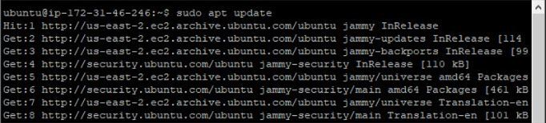

## WEB STACK IMPLEMENTATION (LEMP STACK) - PROJECT 2

1. **Installing the NGINX Web Server**: After creating and logging into my instance via ssh, I ran the following commands:

   a. Update a list of packages in package manager

   - `sudo apt update`

     

   b. Install NGINX

   - `sudo apt install nginx`

     

   c. Verify the status of Apache2 to see if it is running.

   - `sudo systemctl status nginx`

     

   d. Check local access to web through the local host

   - `curl http://localhost:80`

     

   e. Check web access from internet through the firewall

   - `http://3.138.188.10:80`

     
