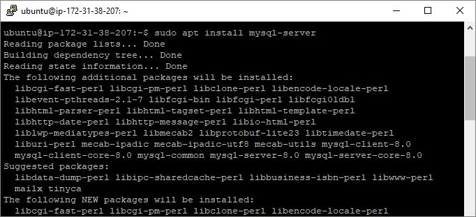
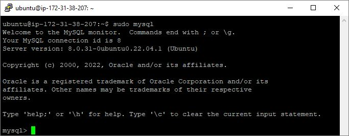
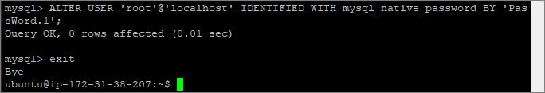
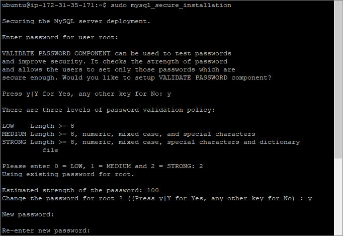
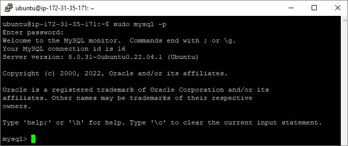

## WEB STACK IMPLEMENTATION (LEMP STACK) - PROJECT 2

1. **Installing the NGINX Web Server**: After creating and logging into my instance via ssh, I ran the following commands:

   a. Update a list of packages in package manager

   - `sudo apt update`

     

   b. Install NGINX

   - `sudo apt install nginx`

     

   c. Verify the status of Apache2 to see if it is running.

   - `sudo systemctl status nginx`

     

   d. Check local access to web through the local host

   - `curl http://localhost:80`

     

   e. Check web access from internet through the firewall

   - `http://3.138.188.10:80`

     

1. **Installing mysql**: After installing Apache, install mysql to be able to store and manage data for your site in a relational database:

   a. Install mysql

   - `sudo apt install mysql-server`

     

   b. Log into mysql console

   - `sudo mysql`

     

   c. Run a script to remove some insecure default settings. Set user’s password as PassWord.1.

   - `ALTER USER 'root'@'localhost' IDENTIFIED WITH mysql_native_password BY 'PassWord.1';`

     

   d. Start the interactive script by running the command below

   - `sudo mysql_secure_installation`

     

   e. Test login to mysql-server using the command below

   - `sudo mysql -p`

     
