## WEB STACK IMPLEMENTATION (LEMP STACK) - PROJECT 2

1. **Installing the NGINX Web Server**: After creating and logging into my instance via ssh, I ran the following commands:

   a. Update a list of packages in package manager

   - `sudo apt update`

     

   b. Install NGINX

   - `sudo apt install nginx`

     

   c. Verify the status of Apache2 to see if it is running.

   - `sudo systemctl status nginx`

     

   d. Check local access to web through the local host

   - `curl http://localhost:80`

     

   e. Check web access from internet through the firewall

   - `http://3.138.188.10:80`

     

1. **Installing mysql**: After installing Apache, install mysql to be able to store and manage data for your site in a relational database:

   a. Install mysql

   - `sudo apt install mysql-server`

     

   b. Log into mysql console

   - `sudo mysql`

     

   c. Run a script to remove some insecure default settings. Set user’s password as PassWord.1.

   - `ALTER USER 'root'@'localhost' IDENTIFIED WITH mysql_native_password BY 'PassWord.1';`

     

   d. Start the interactive script by running the command below

   - `sudo mysql_secure_installation`

     

   e. Test login to mysql-server using the command below (enter the new password)

   - `sudo mysql -p`

     

1. **Install php**: After installing Apache to serve your content and MySql installed to store and manage data, install php which is the componet required to process code to display dynamic content to the end user.

   a. Install the dependencies required for php to communicate with mysql and apache

   - `sudo apt install php-fpm php-mysql`

     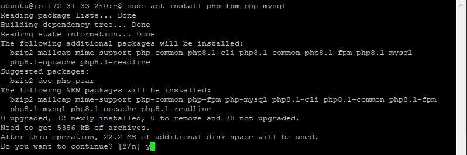

1. **Configuring NGINX to use PHP processor**: When using the Nginx web server, we can create server blocks (similar to virtual hosts in Apache) to encapsulate configuration details and host more than one domain on a single server. We will use aufora as the domain name.

   a. Create directory structure for `aufora` website using 'mkdir' command as follows

   - `sudo mkdir /var/www/aufora`

     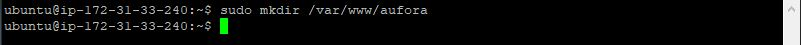

   b. Assign ownership of directory with the current  using `$USER` which will reference the current system user.

   - `sudo chown -R $USER:$USER /var/www/aufora`

     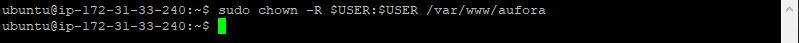

   c. Create and open a new config file in nginx's `sites available` directory using nano editor

   - `sudo nano /etc/nginx/sites-available/aufora`

   - Paste the folowing in the snippet below

     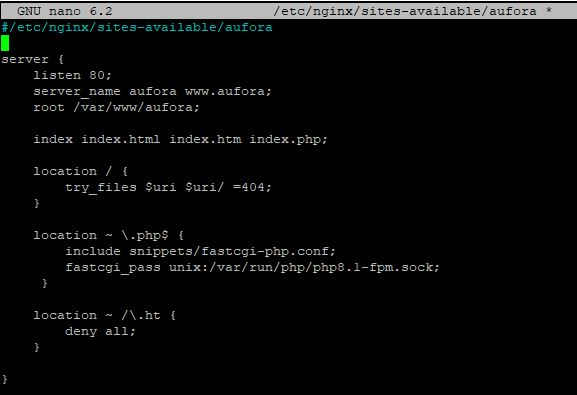

   d. Activate your configuration by linking to the config file from Nginx’s `sites-enabled` directory

   - `sudo ln -s /etc/nginx/sites-available/aufora /etc/nginx/sites-enabled/`

     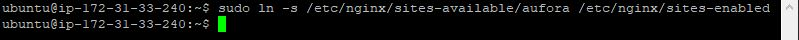

   e. Test the configuration for syntax errors 

   - `sudo unlink /etc/nginx/sites-enabled/default`

     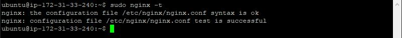

   f. Disable the default nginx host that is currently configured to listen on port 80 

   - `sudo nginx -t`

     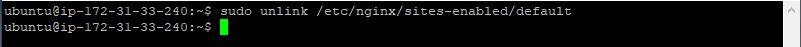

   g. Reload nginx to apply changes 

   - `sudo systemctl reload nginx`

     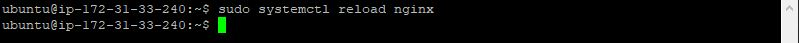

   h. Create an `index.html` file in the web root location `/var/www/aufora` so that we can test if the new server block works as expected 

   - `sudo echo 'Hello LEMP from AUFORA' $(curl -s http://169.254.169.254/latest/meta-data/public-hostname) 'with public IP' $(curl -s http://169.254.169.254/latest/meta-data/public-ipv4) > /var/www/aufora/index.html`

     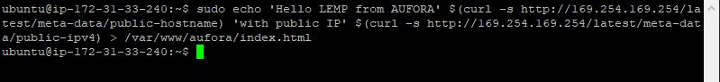

   i. Launch the new website using the public IP

   - `http://3.145.13.48`

     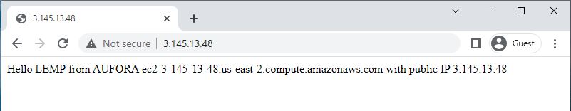

   j. Launch the new website using the public DNS

   - `http://ec2-3-145-13-48.us-east-2.compute.amazonaws.com/`

     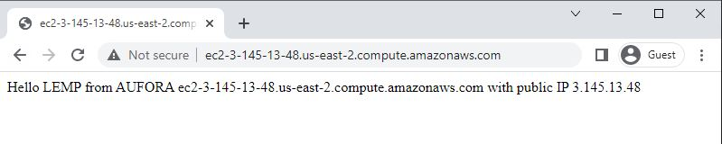

1. **Testing PHP with nginx**: The LEMP stack is completely installed and fully operational.

   a. Test the LEMP stack to validate nginx can correctly hand `.php` files off to the PHP processor. This can be done by creating a test PHP file in your document root. Open a new file called `info.php` within the document root using the text editor

   - `sudo nano /var/www/aufora/info.php`
   - Paste the code from the below snippet 

     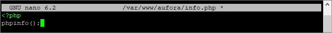

   b. Access the page from a web browser via the domain name or public IP address set up in your nginx configuration file, followed by /`info.php`:

   - `http://18.117.109.175`
  
     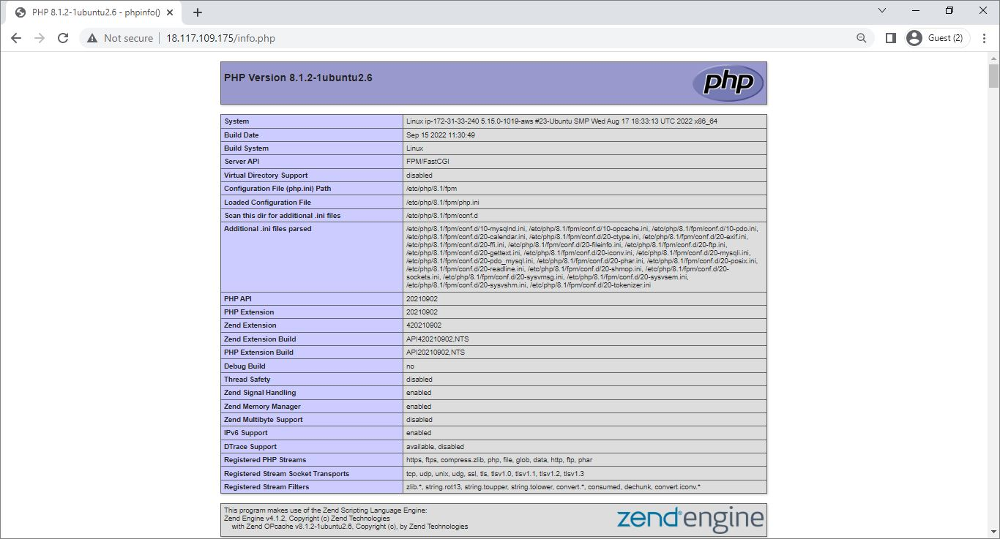

   c. After checking relevant information about the PHP server through the above page, it is best practice to remove the file that was created as it contains sensitive information about the PHP environment and the Ubuntu server. Use `rm` to remove the file:

   - `sudo rm /var/www/aufora/info.php`
  
     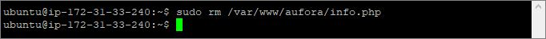

   d. The `info.php` file can be regenerated if required.

1. **Retrieving Data from MySql database with PHP**: Create a test database (DB) with simple "To do list" and configure access to it, so the nginx website would be able to query data from the DB and display it.

   a. Connect to mysql console using the root account and create a database named aufora_database and a user named aufora_user

   - `sudo mysql`
   
     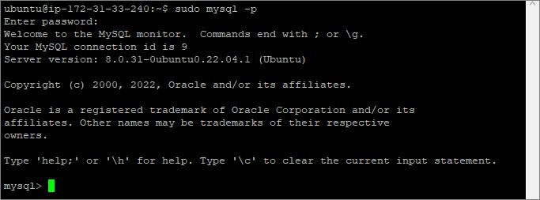

   - `CREATE DATABASE aufora_database;`
   
     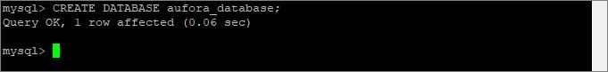

   b. create a new user and grant it full privileges on the database you have just created. 
   
   The following command creates a new user named `aufora_user`, using mysql_native_password as default authentication method. We are defining the user’s password as `password`, but you should replace this value with a secure password of your own choosing.
   - `CREATE USER 'aufora_user'@'%' IDENTIFIED WITH mysql_native_password BY 'P@ssw0rd';`
   
     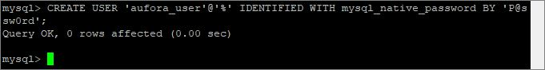