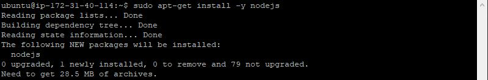

## WEB STACK IMPLEMENTATION (MERN STACK)
---
1. **Backend Configuration**: 

   a. Update a list of packages in package manager

   - `sudo apt update`
   

   b. Upgrade Ubuntu

   - `sudo apt upgrade`
   

   c. Get the location of `node.js` software from Ubuntu repositories.
   
   - `curl -fsSL https://deb.nodesource.com/setup_18.x | sudo -E bash -`

     

   d. Install `node.js` on the Server. The command below will install both `nodejs` and `npm`. NPM is a special package for `nodejs` just like `apt` for ubuntu.
   
   - `sudo apt-get install -y nodejs`

     
