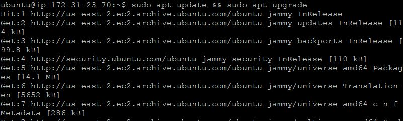
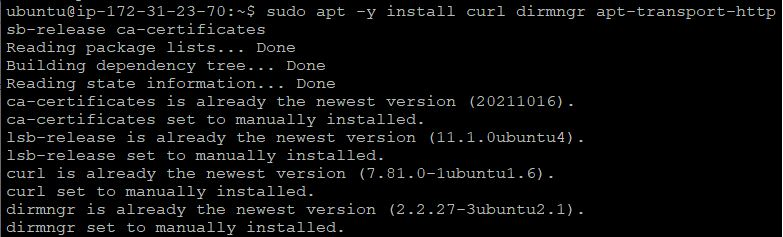
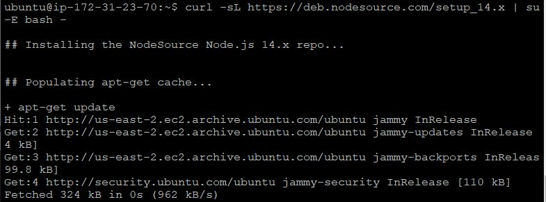
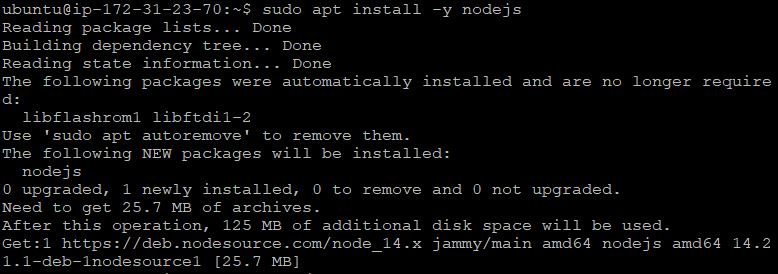
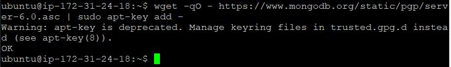
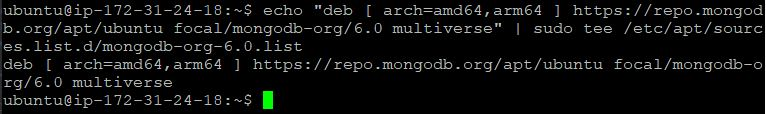

## DOCUMENTATION ON MEAN STACK DEPLOYMENT - PROJECT 4 ##
---
**MEAN** stack is a combination of the following components:
  - **MongoDB** : This is a document database which stores and allows data retrieval.
  - **Express** : This is a back-end application frame work which makes requests to tke database for read/write.
  - **Angular** : This is a front end application framework which handles client server requests.
  - **Node.js** : This is the JavaScript runtime enviroment which accepts requests and displays it's results to the end user.
  
1. **INSTALL NODE JS**: `node.js` is a JavaScript runtime built on Chrome's v8 JavaScript engine. `node.js` is used in this tutorial to setup the express routes and AngularJS controllers. 

   a. Update and upgrade ubuntu

    - `sudp apt update && sudo apt upgrade`

      

   b. Add Certificates

   - `sudo apt -y install curl dirmngr apt-transport-https lsb-release ca-certificates`

     

   - `curl -sL https://deb.nodesource.com/setup_14.x | sudo -E bash -`

     

   c. Install `node.js`
    - `sudo apt install -y nodejs`
        
      

1. **INSTALL MONGO DB**: MongoDB stores data in flexible `JASON-like` documents. Fields in a database can vary form document to document and the structure can be changed overtime. 

   a. In our example application, we will add book records to MongoDB that contain bppk name, isbn number, author and number of pages.
   - `sudo apt-key adv --keyserver hkp://keyserver.ubuntu.com:80 --recv 0C49F3730359A14518585931BC711F9BA15703C6`
   
     

   - `echo "deb [ arch=amd64 ] https://repo.mongodb.org/apt/ubuntu trusty/mongodb-org/3.4 multiverse" | sudo tee /etc/apt/sources.list.d/mongodb-org-3.4.list`

     

   b. Install MongoDB
   - `sudo apt install -y mongodb`   
