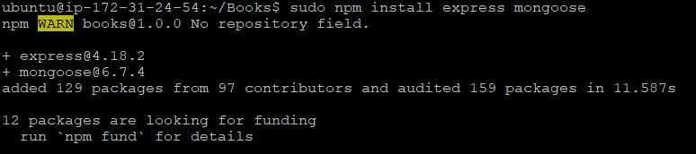

## DOCUMENTATION ON MEAN STACK DEPLOYMENT - PROJECT 4 ##
---
**MEAN** stack is a combination of the following components:
  - **MongoDB** : This is a document database which stores and allows data retrieval.
  - **Express** : This is a back-end application frame work which makes requests to tke database for read/write.
  - **Angular** : This is a front end application framework which handles client server requests.
  - **Node.js** : This is the JavaScript runtime enviroment which accepts requests and displays it's results to the end user.
  
1. **INSTALL NODE JS**: `node.js` is a JavaScript runtime built on Chrome's v8 JavaScript engine. `node.js` is used in this tutorial to setup the express routes and AngularJS controllers. 

   a. Update and upgrade ubuntu

    - `sudp apt update && sudo apt upgrade`

      

   b. Add Certificates

   - `sudo apt -y install curl dirmngr apt-transport-https lsb-release ca-certificates`

     

   - `curl -sL https://deb.nodesource.com/setup_14.x | sudo -E bash -`

     

   c. Install `node.js`
    - `sudo apt install -y nodejs`
        
      

1. **INSTALL MONGO DB**: MongoDB stores data in flexible `JASON-like` documents. Fields in a database can vary form document to document and the structure can be changed overtime. our example application, we will add book records to MongoDB that contain bppk name, isbn number, author and number of pages. 

   a. Import MongoDB publick key 
   - `wget -qO - https://www.mongodb.org/static/pgp/server-6.0.asc | sudo apt-key add -`
   
     


   b. Create the list file using the command for the version of Ubuntu. In our case Ubuntu 22.04 is jammy  
   - `echo "deb [ arch=amd64,arm64 ] https://repo.mongodb.org/apt/ubuntu focal/mongodb-org/6.0 multiverse" | sudo tee /etc/apt/sources.list.d/mongodb-org-6.0.list`
   
     

   c. Reload the local package database  
   - `sudo apt update`
   
     
 

   d. Install MongoDB  
   - `sudo apt install -y mongodb-org`
   
       

   e. In case you get libssl error from the above command 
You can download & install the package from http://archive.ubuntu.com/ubuntu/pool/main/o/openssl/ and reinstall MongoDB  
   - `curl -LO http://archive.ubuntu.com/ubuntu/pool/main/o/openssl/libssl1.1_1.1.1-1ubuntu2.1~18.04.20_amd64.deb`
   
       

   - `sudo dpkg -i ./libssl1.1_1.1.1-1ubuntu2.1~18.04.20_amd64.deb`
   
      

   - `sudo apt install -y mongodb-org`
   
        

   f. Check MongoDB version
   - `mongod -version`
   
      

   g. Start and enable MongoDB and confirm its status
   - `sudo systemctl start mongod`
   - `sudo systemctl status mongod`
   
      

   h. Install `npm` -Node package manager and check the version
   - `sudo apt install -y npm`

      

    - `npm -v`

      

  
   i. Create a folder named Books and in the Books directory, initialize `npm` project
   - `mkdir Books && cd Books`
   - `npm init`

      

   j. Install `body-parser` package
   - `sudo npm install body-parser`

      

   k. Add a file named `server.js`and paste the code as shown in the steps below
   - `vi server.js`
     ```var express = require('express');
        var bodyParser = require('body-parser');
        var app = express();
        app.use(express.static(__dirname + '/public'));
        app.use(bodyParser.json());
        require('./apps/routes')(app);
        app.set('port', 3300);
        app.listen(app.get('port'), function() {
            console.log('Server up: http://localhost:' + app.get('port'));
        });
     ```
           


1. **INSTALL EXPRESS AND SETUP ROUTES TO THE SERVER DB**: Express is a minimal and flexible `Node.js` web application framework that provides features for web and mobile applications. We will use Express to pass book information to and from the MongoDB database.

   We will use Mongoose package which provides a straight-forward, schema based solution to the model application data. We will also use Mongoose to establish a schema for the database to store data of our book register. 

   a. Install Express using Mongoose package; navigate to the **Books** directory and instakk express.
   
   - `sudo npm install express mongoose`
     

   b. Create a folder named `apps` in **Books** folder and within `apps`, create a file named `routes.js` and copy and paste the code on the third step below into `routes.js` file.

   - `mkdir apps && cd apps`
   - `vi routes.js`

      ```py
      var Book = require('./models/book');
      module.exports = function(app) {
        app.get('/book', function(req, res) {
          Book.find({}, function(err, result) {
            if ( err ) throw err;
            res.json(result);
          });
        }); 
        app.post('/book', function(req, res) {
          var book = new Book( {
            name:req.body.name,
            isbn:req.body.isbn,
            author:req.body.author,
            pages:req.body.pages
          });
          book.save(function(err, result) {
            if ( err ) throw err;
            res.json( {
              message:"Successfully added book",
              book:result
            });
          });
        });
        app.delete("/book/:isbn", function(req, res) 
      {
          Book.findOneAndRemove(req.query, 
      function(err, result) {
            if ( err ) throw err;
            res.json( {
              message: "Successfully deleted the 
      book",
              book: result
            });
          });
        });
        var path = require('path');
        app.get('*', function(req, res) {
          res.sendfile(path.join(__dirname + 
      '/public', 'index.html'));
        });
      };
     ```

       


   c. In the `apps` folder create another folder named `models` and within `models` folder create a file named `book.js`. Copy and paste the code on the third step below into `book.js` file.

   - `mkdir models && cd models`
   - `vi book.js`

       ```py
        var mongoose = require('mongoose');
        var dbHost = 'mongodb://localhost:27017/test';
        mongoose.connect(dbHost);
        mongoose.connection;
        mongoose.set('debug', true);
        var bookSchema = mongoose.Schema( {
          name: String,
          isbn: {type: String, index: true},
          author: String,
          pages: Number
        });
        var Book = mongoose.model('Book', bookSchema);
        module.exports = mongoose.model('Book', bookSchema);
       ```  
       

1. **ACCESS THE ROUTES WITH ANGULAR JS**: AngularJS provides a web framework for creating dynamic views in web applications. We will use **AngularJS** to connect to the web page with **Express** and perform some actions on the book register. 

    a. Change the directory back to **Books**, create a folder named `public`, navigate to the public directory and create a file `script.js`. Paste the code in the fourth step into `script.js` file.
   
     - `cd ../..`
     - `mkdir public && cd public`
     - `vi script.js`
       
       ```py
        var app = angular.module('myApp', []);
        app.controller('myCtrl', function($scope, $http) {
          $http( {
            method: 'GET',
            url: '/book'
          }).then(function successCallback(response) {
            $scope.books = response.data;
          }, function errorCallback(response) {
            console.log('Error: ' + response);
          });
          $scope.del_book = function(book) {
            $http( {
              method: 'DELETE',
              url: '/book/:isbn',
              params: {'isbn': book.isbn}
            }).then(function successCallback(response)
        {
              console.log(response);
            }, function errorCallback(response) {
              console.log('Error: ' + response);
            });
          };
          $scope.add_book = function() {
            var body = '{ "name": "' + $scope.Name + 
            '", "isbn": "' + $scope.Isbn +
            '", "author": "' + $scope.Author + 
            '", "pages": "' + $scope.Pages + '" }';
            $http({
              method: 'POST',
              url: '/book',
              data: body
            }).then(function successCallback(response)
        {
              console.log(response);
            }, function errorCallback(response) {
              console.log('Error: ' + response);
            });
          };
        });
        ```

       

      b. In `public` folder, create a file named `index.html` and paste the code in the second step.
   
      - `vi index.html`

        ```py
        <!doctype html>
        <html ng-app="myApp" ng-controller="myCtrl">
          <head>
            <script src="https://ajax.googleapis.com/ajax/libs/angularjs/1.6.4/angular.min.js"></script>
            <script src="script.js"></script>
          </head>
          <body>
            <div>
              <table>
                <tr>
                  <td>Name:</td>
                  <td><input type="text" ng-model="Name"></td>
                </tr>
                <tr>
                  <td>Isbn:</td>
                  <td><input type="text" ng-model="Isbn"></td>
                </tr>
                <tr>
                  <td>Author:</td>
                  <td><input type="text" ng-model="Author"></td>
                </tr>
                <tr>
                  <td>Pages:</td>
                  <td><input type="number" ng-model="Pages"></td>
                </tr>
              </table>
              <button ng-click="add_book()">Add</button>
            </div>
            <hr>
            <div>
              <table>
                <tr>
                  <th>Name</th>
                  <th>Isbn</th>
                  <th>Author</th>
                  <th>Pages</th>

                </tr>
                <tr ng-repeat="book in books">
                  <td>{{book.name}}</td>
                  <td>{{book.isbn}}</td>
                  <td>{{book.author}}</td>
                  <td>{{book.pages}}</td>

                  <td><input type="button" value="Delete" data-ng-click="del_book(book)"></td>
                </tr>
              </table>
            </div>
          </body>
        </html>
          ```
        

      b. Change the directory back to **Books** and start the server by running the command below.
   
      - `node server.js`

        

      c. On the browser open the `url` on port 3300 and enter parameters.

      - `http://3.145.144.172:3300/`

        

        

        