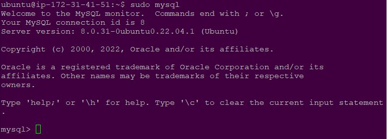

**IMPLEMENT A CLIENT SERVER ARCHITECTURE USING MYSQL DATABASE MANAGEMENT SYSTEM (DBMS)**
___
1. This Project is required to demonstrate a basic client-server using MySQL Relational Database Management System (RDBMS), follow the below instructions. We will have to create and configure two Linux-based virtual servers; `mysql server` and `mysql client`.

1. On `mysql server` install `mysql-server` software.

   - `sudo apt install mysql-server`

      

    - `sudo apt systemctl status mysql`

      

1. Log into mysql console.

   - `sudo mysql`

      

1. Run a script to remove some insecure default settings. Set user’s password as PassWord.1

    - `ALTER USER 'root'@'localhost' IDENTIFIED WITH mysql_native_password BY 'PassWord.1';`

      

1. Start the interactive script by running the command below:

    - `sudo mysql_secure_installation`

      

1. Test login to mysql-server using the command below:

    - `sudo mysql -p`

      

1. Allow access/connections to `mysql client`from remote hosts and repace `127.0.0.1` with `0.0.0.0`

    - `sudo vi /etc/mysql/mysql.conf.d/mysqld.cnf`

      

1. Create a user in `mysql` and add the IP address of the client system you want to grant access to and then give privileges. In our case the client IP is `3.22.100.101`.

    - `sudo mysql -p`
    - `CREATE USER 'tarzan'@'3.22.100.101' IDENTIFIED BY 'P@ssw0rd';`
    - `GRANT ALL PRIVILEGES ON *.* TO 'tarzan'@'3.22.100.101';`
    
      

1. Navigate to `mysql-client` and connect remotely to `mysql-server` database engine with the user name `tarzan` and `mysql-server` IP; `18.116.239.78` in our own case. Also check the databases once connected sussessfully.

    - `mysql -u tarzan -h 18.116.239.78 -p`
    - `SHOW DATABASES;`
    
      

1. Create a database `auforaDB` and then `SHOW DATABASES;` to see if it reflects.

    - `CREATE DATABASE auforaDB;`
    - `SHOW DATABASES;`
    
      

1. Remove the database `auforaDB` and then `SHOW DATABASES;` to confirm it.

    - `DROP DATABASE auforaDB;`
    - `SHOW DATABASES;`
    
            