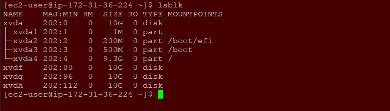
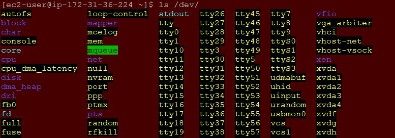
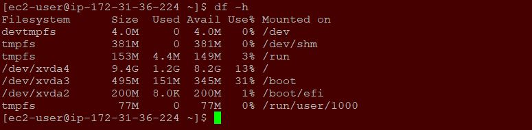
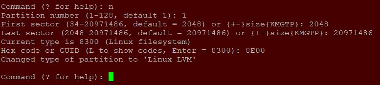

**WEB SOLUTION WITH WORDPRESS - PROJECT 6**
___

In this project, we will configure a storage subsystem for web and database servers using `linux` O.S. Wordpress will be installed and connected remotely to `MySQL` database server. 

Also, this deployment will be based on a `Three-tier Architecture`, a client-server software architecture pattern that comprise of 3 separate layers:

- **Presentation Layer (PL)**: This is the user interface such as the client server or browser on your laptop.

- **Busines Layer (BL)**: This is the backend program that implements business logic, Application or Webserver.

- **Data Access or Management Layer (DAL)**: This is the layer for computer data storage and data access. Database Server or File System Server such as FTP server, or NFS Server.

Use `RedHat` O.S. for this project and `ec2-user` as yhe username when connecting via `ssh/putty`.

**LAUNCH AND PREPARE AN EC2 INSTANCE THAT WIL SERVE AS `WEB SERVER`**
1. On AWS console, create 3 volumes of 10GB each and and on the same AZ as the `web serve` and have them attached on the `web server` EC2 instance.

1. Open the `Linux` terminal and inspect what block devices are attached by running the below command:
   - `lsblk`

     

1. From the above, the names of the newly created/attached devces will be likely `xvdf`, `xvdh`, `xvdg`. Note: All devices in Linux reside in `/dev/` directory. Inspect it wih the command below:

   - `ls /dev/`

     

1. Enter the command below to see all mounts and free space on the `web server`.

   - `df -h`

     

1. Create a single partition on each of the 3 disks using `gdisk` utility.

   - `sudo gdisk /dev/xvdf`

     

