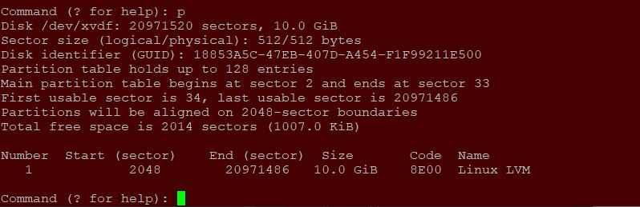
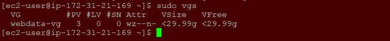
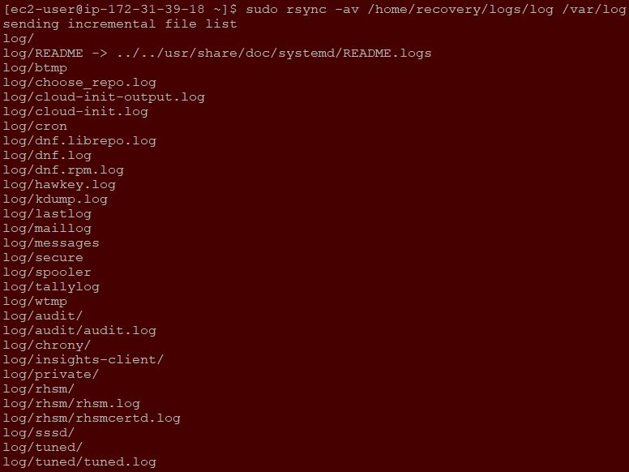
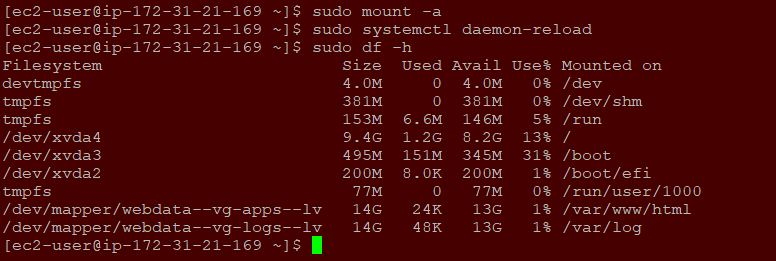

**WEB SOLUTION WITH WORDPRESS - PROJECT 6**
___

In this project, we will configure a storage subsystem for web and database servers using `linux` O.S. Wordpress will be installed and connected remotely to `MySQL` database server. 

Also, this deployment will be based on a `Three-tier Architecture`, a client-server software architecture pattern that comprise of 3 separate layers:

- **Presentation Layer (PL)**: This is the user interface such as the client server or browser on your laptop.

- **Busines Layer (BL)**: This is the backend program that implements business logic, Application or Webserver.

- **Data Access or Management Layer (DAL)**: This is the layer for computer data storage and data access. Database Server or File System Server such as FTP server, or NFS Server.

Use `RedHat` O.S. for this project and `ec2-user` as yhe username when connecting via `ssh/putty`.

**LAUNCH AND PREPARE AN EC2 INSTANCE THAT WIL SERVE AS `WEB SERVER`**

On AWS console, create 3 volumes of 10GB each and on the same AZ as the `web server` and have them attached on the `web server` EC2 instance.

1. Open the `Linux` terminal and inspect what block devices are attached by running the below command:
   - `lsblk`

     

1. From the above, the names of the newly created/attached devces will be likely `xvdf`, `xvdh`, `xvdg`. Note: All devices in Linux reside in `/dev/` directory. Inspect it wih the command below:

   - `ls /dev/`

     

1. Enter the command below to see all mounts and free space on the `web server`.

   - `df -h`

     

1. Create a single partition on each of the 3 disks using `gdisk` utility.

   - `sudo gdisk /dev/xvdf`
   - `?` (Required to print menu)
   - `p` (To print the partition table)

     

1.   The following commands should be entered to create a partition.
     - `n`
     - `1`
     - `2048`
     - `20971486`
     - `8E00`
    
       

1. Enter `p` to confirm/print the partition table.
     - `p`
       
       

1. Write `w` table to disk and exit.
     - `w`
       
       

1. Create partitions for the remaining disks and use `lsblk` utility to view the newly configured partition on each of the 3 disks.
     - `lsblk`
       
       

1. Install `lvm2` package and then run `sudo lvmdiskscan` to check for available partitions.
     - `sudo yum install lvm2`

       
     - `sudo lvmdiskscan`
       
       

1. Mark each of 3 disks as physical volumes (PVs) to be used by LVM using the utility `pvcreate`.
     - `sudo pvcreate /dev/xvdf1`
     - `sudo pvcreate /dev/xvdg1`
     - `sudo pvcreate /dev/xvdh1`

       

1. Verify the Physical volume has been created successfully by running `sudo pvs`.
     - `sudo pvs`
     
       

1. Add all 3 PVs to a volume group (VG). Name the VG `webdata-vg` using the utility `vgcreate`.
     - `sudo vgcreate webdata-vg /dev/xvdh1 /dev/xvdg1 /dev/xvdf1`
     
       

1. Verify that the VG has been created successfully.
     - `sudo vgs`
     
       

1. Create 2 logical volumes `apps-lv` to store data for the Website and `logs-lv` used to store data for logs using `lvcreate` utility.
     - `sudo lvcreate -n apps-lv -L 14G webdata-vg`
     - `sudo lvcreate -n logs-lv -L 14G webdata-vg`
     
       

1. Verify the Logical Volume has been created successfully.
     - `sudo lvs`
          
       

1. Verify and view the complete setup.
     - `sudo vgdisplay -v`
          
       

    - `sudo lsblk`

       

1. Format the Logical Volumes with `ext4` filesystem.
     - `sudo mkfs -t ext4 /dev/webdata-vg/apps-lv`
          
       

    - `sudo mkfs -t ext4 /dev/webdata-vg/logs-lv`
       
       

1. Create `/var/www/html` directory to store website files.
     - `sudo mkdir -p /var/www/html`
          
       

1. Create `/home/recovery/logs` directory to store backup of log data.
     - `sudo mkdir -p /home/recovery/logs`
          
       

1. Mount `/var/www/html` on `apps-lv` Logical Volume.
     - `sudo mount /dev/webdata-vg/apps-lv /var/www/html`
          
       

1. Before mounting the filesystem, use `rsync` utility to backup all the files from the log directory `/var/log` into `/home/recovery/logs`.
     - `sudo rsync -av /var/log/. /home/recovery/logs/`
          
       

1. Mount `/var/log` on `logs-lv` Logical Volume. Note that all the existing data om `/var/log` will be deleted.

     - `sudo mount /dev/webdata-vg/logs-lv /var/log`
          
       

1. Restore the log files back into `/var/log` directory.
     - `sudo rsync -av /home/recovery/logs/. /var/log`
          
       

1. Update the `/etc/fstab` file so that the mount configuration will persist after restart of the server. We will use the UUID of the device to update the `/etc/fstab` file. 
     - `sudo blkid`
          
       

      - `sudo vi /etc/fstab` (paste the UUID on the fstab file)
          
        

1. Test the configuration, reload the daemon and verify the setup. 
     - `sudo mount -a`
     - `sudo systemctl daemon-reload`
     - `sudo df -h`
          
       

**LAUNCH AND PREPARE AN EC2 INSTANCE THAT WIL SERVE AS `DATABASE SERVER`**

On AWS console, create 3 volumes of 10GB each and on the same AZ as the `db server` and have them attached on the `db server` EC2 instance.

1. Open the `Linux` terminal and inspect what block devices are attached by running the below command:
   - `lsblk`

     

    
1. Create a single partition on each of the 3 disks using `gdisk` utility.
   - `sudo gdisk /dev/xvdf`

     

1. Create partitions for the remaining disks and use `lsblk` utility to view the newly configured partition on each of the 3 disks.
   - `lsblk`

     

1. Install `lvm2` package and then run sudo `lvmdiskscan` to check for available partitions.
   - `sudo yum install lvm2`

     

    - `sudo lvmdiskscan`

      

1. Mark each of 3 disks as physical volumes (PVs) to be used by LVM using the utility `pvcreate`.
   - `sudo pvcreate /dev/xvdf1`
   - `sudo pvcreate /dev/xvdg1`
   - `sudo pvcreate /dev/xvdh1`

     

1. Verify the Physical volume has been created successfully by running `sudo pvs`.
   - `sudo pvs`

     

1. Add all 3 PVs to a volume group (VG). Name the VG `dbdata-vg` using the utility `vgcreate`.
   - `sudo vgcreate dbdata-vg /dev/xvdh1 /dev/xvdg1 /dev/xvdf1`

     

1. Verify that the VG has been created successfully.
   - `sudo vgs`

     

1. Create 2 logical volumes `db-lv` to store data for the Website and `logs-lv` used to store data for logs using `lvcreate` utility.
   - `sudo lvcreate -n db-lv -L 14G dbdata-vg`
   - `sudo lvcreate -n logs-lv -L 14G dbdata-vg`
 
     

1. Verify the Logical Volume has been created successfully.
   - `sudo lvs`

     

1. Format the Logical Volumes with `ext4` filesystem.
   - `sudo mkfs -t ext4 /dev/dbdata-vg/db-lv`

     

    - `sudo mkfs -t ext4 /dev/dbdata-vg/logs-lv`

      

1. Create `/db` directory to store the database and `/home/recovery/logs` directory to store database logs.
   - `sudo mkdir /db`

     

    - `sudo mkdir -p /home/recovery/logs`

      

1. Mount `/db` on `db-lv` Logical Volume.
   - `sudo mount /dev/dbdata-vg/db-lv /db`

     

1. Before mounting the filesystem, use `rsync` utility to backup all the files from the log directory `/var/log` into `/home/recovery/logs`.
     - `sudo rsync -av /var/log/. /home/recovery/logs/`
          
       

1. Mount `/var/log` on `logs-lv` Logical Volume. Note that all the existing data om `/var/log` will be deleted.

     - `sudo mount /dev/dbdata-vg/logs-lv /var/log`
          
       

1. Restore the log files back into `/var/log` directory.
     - `sudo rsync -av /home/recovery/logs/. /var/log`
          
       

1. Update the `/etc/fstab` file so that the mount configuration will persist after restart of the server. We will use the UUID of the device to update the `/etc/fstab` file. 
     - `sudo blkid`
          
       

      - `sudo vi /etc/fstab` (paste the UUID on the fstab file)
          
        

1. Test the configuration, reload the daemon and verify the setup. 
     - `sudo mount -a`
     - `sudo systemctl daemon-reload`
     - `sudo df -h`
          
       
