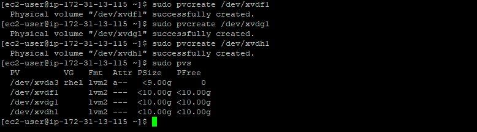
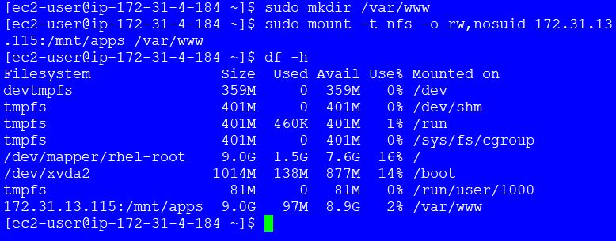

**DEVOPS TOOLING WEBSITE SOLUTION - PROJECT 7**
____

As a member of a DevOps team, you will implement a tooling website solution which makes access to DevOps tools within the corporate infrastructure easily accessible.

In this project you will implement a solution that consists of following components:

1. Infrastructure: AWS
2. Webserver Linux: Red Hat Enterprise  Linux 8
3. Database Server: Ubuntu 20.04 + MySQL
4. torage Server: Red Hat Enterprise Linux 8 + NFS Server
5. Programming Language: PHP
6. Code Repository: GitHub

On the diagram below you can see a common pattern where several stateless Web Servers share a common database and also access the same files using `Network File Sytem (NFS)` as a shared file storage. Even though the NFS server might be located on a completely separate hardware – for Web Servers it look like a local file system from where they can serve the same files.


It is important to know what storage solution is suitable for what use cases, for this – you need to answer following questions: what data will be stored, in what format, how this data will be accessed, by whom, from where, how frequently, etc. Base on this you will be able to choose the right storage system for your solution.

**STEP 1 - PREPARE NFS SERVER**
1. Setup up a new EC2 instance with RHEL Linux 8 Operating System.
2. Create 3 volumes in the same AZ as your Web Server EC2, each of 10 GiB
3. Attach all three volumes one by one to your Web Server EC2 instance
4. On the NFS/Linux terminal, use `lsblk` command to inspect what block devices are attached to the server. Notice names of your newly created devices. All devices in Linux reside in /dev/ directory. 

   - `lsblk`

     

5. Inspect it with `ls /dev/` and make sure you see all 3 newly created block devices there – their names will likely be `xvdf`, `xvdh`, `xvdg`. Also, use `df -h` command to see all mounts and free space on your server.

6. Use `gdisk` utility to create a single partition on each of the 3 disks.

   - `sudo gdisk /dev/xvdg`

     

7. Use `lsblk` utility to view the newly configured partition on each of the 3 disks.
   - `lsbk`

     

8. Install `lvm2` package using `sudo yum install lvm2` and run `sudo lvmdiskscan` command to check for available partitions.

   - `sudo yum install lvm2`
   - `sudo lvmdiskscan`

     

9. Use `pvcreate` utility to mark each of 3 disks as physical volumes (PVs) to be used by LVM.

    - `sudo pvcreate /dev/xvdf1`
    - `sudo pvcreate /dev/xvdg1`
    - `sudo pvcreate /dev/xvdh1`

      

    Verify that your Physical volume has been created successfully by running `sudo pvs`

     - `sudo pvs`

10. Use `vgcreate` utility to add all 3 PVs to a volume group (VG). Name the VG `webdata-vg`and verify that your VG has been created successfully by running `sudo vgs`.

    - `sudo vgcreate webdata-vg /dev/xvdh1 /dev/xvdg1 /dev/xvdf1`
    - `sudo vgs`
  
      

11. Use `lvcreate` utility to create 3 logical volumes `lv-apps`, `lv-logs` and `lv-opt`.(Use 9GB of the PV size for each). **NOTE**: `lv-apps` and `lv-logs` will be used to store data and log files for the Website while `lv-opt` will be used for `Jenkins` in Project 8.

    - `sudo lvcreate -n lv-apps -L 9G webdata-vg`
    - `sudo lvcreate -n lv-logs -L 9G webdata-vg`
    - `sudo lvcreate -n lv-opt -L 9G webdata-vg`
  
      

12. Use `mkfs.xfs` to format the logical volumes with `xfs` filesystem.

    - `sudo mkfs -t xfs /dev/webdata-vg/lv-apps`
    - `sudo mkfs -t xfs /dev/webdata-vg/lv-logs`
    - `sudo mkfs -t xfs /dev/webdata-vg/lv-opt`
  
      

13. Navigate to `/mnt` directory and create `apps`, `logs` and `opt` folders. Also, Create mount points on `/mnt` directory for the logical volumes as follows:
- Mount `lv-apps` on `/mnt/apps` – To be used by webservers
- Mount `lv-logs` on `/mnt/logs` – To be used by webserver logs
 - Mount `lv-opt` on `/mnt/opt` – To be used by `Jenkins` server in Project 8

    - `sudo mount /dev/webdata-vg/lv-apps /mnt/apps`
    - `sudo mount /dev/webdata-vg/lv-logs /mnt/logs`
    - `sudo mount /dev/webdata-vg/lv-opt /mnt/opt`
  
      

14. Install NFS server, configure it to start on reboot and make sure it is up and running.

    - `sudo yum -y update`
    - `sudo yum install nfs-utils -y`
    - `sudo systemctl start nfs-server.service`
    - `sudo systemctl enable nfs-server.service`
    - `sudo systemctl status nfs-server.service`
  
      

15. Export the mounts for webservers’ `subnet cidr` to connect as clients. For simplicity, you will install your all three Web Servers inside the same subnet, but in production set up you would probably want to separate each tier inside its own subnet for higher level of security. To check your `subnet cidr` – open your EC2 details in AWS web console and locate ‘Networking’ tab and open a Subnet link:

    

16. Set permission that will allow our Web servers to read, write and execute files on NFS:

    - `sudo chown -R nobody: /mnt/apps`
    - `sudo chown -R nobody: /mnt/logs`
    - `sudo chown -R nobody: /mnt/opt`

    - `sudo chmod -R 777 /mnt/apps`
    - `sudo chmod -R 777 /mnt/logs`
    - `sudo chmod -R 777 /mnt/opt`

    - `sudo systemctl restart nfs-server.service`

      

17. Navigate to `/etc` and create a file `exports` to allow NFS for clients within the same subnet (Our `Subnet CIDR – 172.31.0.0/20` ):

    - `sudo vi /etc/exports`
    - Paste the script below
   
      ```py
        /mnt/apps 172.31.0.0/20(rw,sync,no_all_squash,no_root_squash)
        /mnt/logs 172.31.0.0/20(rw,sync,no_all_squash,no_root_squash)
        /mnt/opt 172.31.0.0/20(rw,sync,no_all_squash,no_root_squash)
      ```

      

18. Run `exports -arv` and check which port is used by NFS and open it using Security Groups (add new Inbound Rule)
    - `sudo exportfs -arv`
    - `rpcinfo -p | grep nfs`

      

19. **Important note**: In order for NFS server to be accessible from your client, you must also open following ports: TCP 111, UDP 111, UDP 2049

    

**STEP 2 - CONFIGURE THE DATABASE SERVER**
1. Install `mysql` Server.

   - `sudo yum update`
   - `sudo yum install mysql-server`
   - `sudo systemctl restart mysqld`
   - `sudo systemctl enable mysqld`
   - `sudo systemctl status mysqld`

     

2. Create a database and name it `tooling`, create a database user named `webaccess` and also grant permission to `webaccess` user on `tooling` database to do anything only from the webservers `subnet cidr`.
   - `sudo mysql`
   - `CREATE DATABASE tooling;`
   - `CREATE USER 'webaccess'@'172.31.0.0/20' IDENTIFIED BY 'password';`
   - `GRANT ALL ON tooling.* TO 'webaccess'@'172.31.0.0/20';`
   - `FLUSH PRIVILEGES;`
   - `SHOW DATABASES;`

     

**STEP 3 - PREPARE THE WEB SERVERS**
We need to make sure that our Web Servers can serve the same content from shared storage solutions, in our case – NFS Server and MySQL database.

one DB can be accessed for `read/write` by multiple clients. For storing shared files that our Web Servers will use, we will utilize NFS and mount previously created Logical Volume `lv-apps` to the folder where Apache stores files to be served to the users (`/var/www`).

This approach will make our Web Servers `stateless`, which means we will be able to add new ones or remove them whenever we need, and the integrity of the data (in the database and on NFS) will be preserved.

- The following stages will be carried out during this step

  - Configure NFS client (this step must be done on all three servers)
   - Deploy a Tooling application to our Web Servers into a shared NFS folder
   - Configure the Web Servers to work with a single MySQL database

1. Launch a new EC2 instance with RHEL 8 Operating System required for the Web Server.
2. Install NFS client  
    - `sudo yum install nfs-utils nfs4-acl-tools -y`

      

3. Mount `/var/www/` and target the NFS server’s export for apps and verify that NFS was mounted successfully by running `df -h`.
    - `sudo mkdir /var/www`
    - `sudo mount -t nfs -o rw,nosuid <NFS-Server-Private-IP-Address>:/mnt/apps /var/www`

      

4. Make sure that the changes will persist on Web Server after reboot by updating the `fstab`with `<NFS-Server-Private-IP-Address>:/mnt/apps /var/www nfs defaults 0 0`.
    - `sudo vi /etc/fstab`
    - `<NFS-Server-Private-IP-Address>:/mnt/apps /var/www nfs defaults 0 0`

      

5. Install `Remi’s repository`, `Apache` and `PHP`.
    - `sudo yum install httpd -y`
    - `sudo dnf install https://dl.fedoraproject.org/pub/epel/epel-release-latest-8.noarch.rpm`
    - `sudo dnf install dnf-utils http://rpms.remirepo.net/enterprise/remi-release-8.rpm`
    - `sudo dnf module reset php`
    - `sudo dnf module enable php:remi-7.4`
    - `sudo dnf install php php-opcache php-gd php-curl php-mysqlnd`
    - `sudo systemctl start php-fpm`
    - `sudo systemctl enable php-fpm`
    - `setsebool -P httpd_execmem 1`

      

**Repeat steps 1-5 for another 2 Web Servers.**

6. Verify that Apache files and directories are available on the Web Server in `/var/www` and also on the NFS server in `/mnt/apps`. If you see the same files – it means NFS is mounted correctly. You can try to create a new file `touch test.txt` from one server and check if the same file is accessible from other Web Servers.

   

   

  7. Locate the log folder for Apache on the Web Server and mount it to NFS server’s export for logs. Repeat step №4 to make sure the mount point will persist after reboot.

      

8. Fork the tooling source code from [Mervin Github Account](https://github.com/Eruchie/tooling) to your own Github account.

9. Install and initialize `git` on the `web servers` and then clone the tooling repository.

    - `sudo yum install git`
    
      

    - `git init`
    
      

    - `git clone https://github.com/Eruchie/tooling.git`

      

10. Deploy the tooling website’s code to the Webserver and ensure that the **html** folder from the repository is deployed to `/var/www/html`.

    - `cd tooling`
    - `ls`
    - `sudo cp -R html/. /var/www/html`
    - `ls /var/www/html`
    
      

11. Ensure to to open TCP port 80 on the Web Servers and also disable SELinux `sudo setenforce 0`. To make this change permanent – open following config file `sudo vi /etc/sysconfig/selinux` and set SELINUX=disabled then restart `httpd`.

    - `cd ~ && sudo setenforce 0`
    - `sudo vi /etc/sysconfig/selinux`
    
      

12. Enable,restart and check the status of `httpd` service to ensure it is running.

    - `sudo systemctl enable httpd`
    - `sudo systemctl restart httpd`
    - `sudo systemctl status httpd`
     
      

13. Open the website in your browser http://<`Web-Server-Public-IP-Address-or-Public-DNS-Name`> and make sure you can login into the website with `xMerv` user.

     - `http://<Web-Server-Public-IP-Address-or-Public-DNS-Name>`
    
       

14. Update the website’s configuration to connect to the database (in `/var/www/html/functions.php` file). 

    - `sudo vi /var/www/html/functions.php`

      

 15. Install `mysql` client on the web Server(s).

     - `sudo yum install mysql`

       

16. Create in MySQL a new admin user with username: `xMerv` and password: `password`. Use the string 5f4dcc3b5aa765d61d8327deb882cf99 which equates to `password`

     - `cd tooling`
     - `sudo vi tooling-db.sql`

        ```
            INSERT INTO ‘users’ (‘id’, ‘username’, ‘password’, ’email’, ‘user_type’, ‘status’) VALUES
            -> (1, ‘xMerv’, ‘5f4dcc3b5aa765d61d8327deb882cf99’, ‘xMerv@merv.com’, ‘admin’, ‘1’);
        ```
     
       

 17. Apply `tooling-db.sql` script to the database using this command mysql -h <`databse-private-ip`> -u <`db-username`> -p <`db-pasword`> < tooling-db.sql.

     - `mysql -h <databse-private-ip> -u <db-username> -p <db-pasword> < tooling-db.sql`

       

18. Open the website in your browser http://<`Web-Server-Public-IP-Address-or-Public-DNS-Name/index.php`> and make sure you can login into the website with `xMerv` user.

     - `http://<Web-Server-Public-IP-Address-or-Public-DNS-Name>/index.php`

       

       


        

    