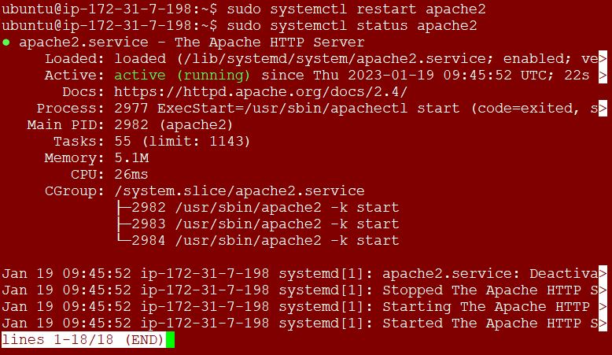

**LOAD BALANCER SOLUTION WITH APACHE - PROJECT 8**
____

In this project we will enhance our **Tooling Website** solution by adding a Load Balancer to disctribute traffic between Web Servers and allow users to access our website using a single URL.

The updated solution architecture will look like the snippet below, with an LB added on top of Web Servers (for simplicity let us assume it is a software L7 Application LB, for example – Apache, NGINX or HAProxy)


**TASK**
To deploy and configure an Apache Load Balancer for **Tooling Website** solution on a separate Ubuntu EC2 intance. Make sure that users can be served by Web servers through the Load Balancer. We will implement this solution with 2 Web Servers.

 - **Prerequisites**

    Make sure that you have following servers installed and configured within Project-7:

    - Two RHEL8 Web Servers
    - One MySQL DB Server (based on Ubuntu 20.04)
    - One RHEL8 NFS server

**STEP 1 - CONFIGURE APACHE AS A LOAD BALANCER**

1. Create an Ubuntu Server 20.04 EC2 instance and name it `Project-8-apache-lb`

2. Open TCP port 80 on `Project-8-apache-lb` by creating an Inbound Rule in Security Group.

3. Install Apache Load Balancer on `Project-8-apache-lb` server and configure it to point traffic coming to LB to both Web Servers by running the commands below:

   #Install apache2
    - `sudo apt update`
    - `sudo apt install apache2 -y`
    - `sudo apt-get install libxml2-dev `
    
   #Enable following modules:
    - `sudo a2enmod rewrite`
    - `sudo a2enmod proxy`
    - `sudo a2enmod proxy_balancer`
    - `sudo a2enmod proxy_http`
    - `sudo a2enmod headers`
    - `sudo a2enmod lbmethod_bytraffic`

      

4. Restart `apache2` and make sure it is up and running. 

   #Restart apache2 service
   - `sudo systemctl restart apache2`
   - `sudo systemctl status apache2`

     

5. Configure the Load Balancer. 

   - `sudo vi /etc/apache2/sites-available/000-default.conf`
   
   #Add the configuration below into this section `<VirtualHost *:80>  </VirtualHost>`

   ```py
    <Proxy "balancer://mycluster">
               BalancerMember http://<WebServer1-Private-IP-Address>:80 loadfactor=5 timeout=1
               BalancerMember http://<WebServer2-Private-IP-Address>:80 loadfactor=5 timeout=1
               ProxySet lbmethod=bytraffic
               # ProxySet lbmethod=byrequests
        </Proxy>

        ProxyPreserveHost On
        ProxyPass / balancer://mycluster/
        ProxyPassReverse / balancer://mycluster/
   ```

     

6. Restart the apache service. 

   - `sudo systemctl restart apache2`

   - **NOTE**: `bytraffic` balancing method will distribute incoming load between your Web Servers according to current traffic load. We can control in which proportion the traffic must be distributed by `loadfactor` parameter.

     There are other balancing methods e.g. `bybusyness`, `byrequests`, `heartbeat` 

7. Verify that the configuration works – try to access the LB’s public IP address or Public DNS name from your browser: 

   - `http://<Load-Balancer-Public-IP-Address-or-Public-DNS-Name>/index.php`

     

8. In  Project-7 we mounted `/var/log/httpd/` from the Web Servers to the NFS server – unmount them and make sure that each Web Server has its own log directory.

   Open two ssh/Putty consoles for both Web Servers and run following command:
   
   - `sudo tail -f /var/log/httpd/access_log`

     

      

9. Refresh the browser page http://`<Load-Balancer-Public-IP-Address-or-Public-DNS-Name>`/index.php several times and make sure that both servers receive HTTP GET requests from your LB – new records must appear in each server’s log file. The number of requests to each server will be approximately the same since we set `loadfactor` to the same value for both servers – it means that traffic will be disctributed evenly between them. 

   If the LB was configured correctly – users will not notice that their requests are served by more than one server.

10. Configure Local DNS Names Resolution. The easiest way is to use `/etc/hosts` file, although this approach is not very scalable, but it is very easy to configure and shows the concept well. So let us configure IP address to domain name mapping for our LB. 

    #Open this file on your LB server

    - `sudo vi /etc/hosts`
    
    #Add 2 records into this file with Local IP address and arbitrary name for both of your Web Servers

    - `<WebServer1-Private-IP-Address> Web1`
    - `<WebServer2-Private-IP-Address> Web2`

      

11. Update your LB config file with those names instead of IP addresses.
    - `BalancerMember http://Web1:80 loadfactor=5 timeout=1`
    - `BalancerMember http://Web2:80 loadfactor=5 timeout=1`

      

12. `curl` the Web Servers from LB locally `curl http://Web1` or `curl http://Web2`.

    - `curl http://Web1:80`

      

    - `curl http://Web2:80`

      

**Targed Architecture**

Now your set up looks like this:

 


 