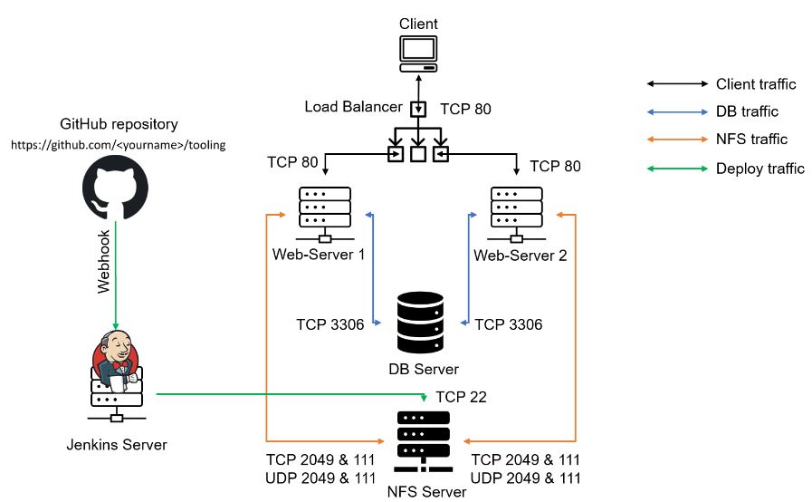
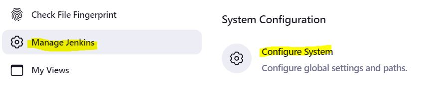

**CONTINOUS INTEGRATION PIPELINE FOR TOOLING WEBSITE - PROJECT 9**
___
In this project we are going to start automating part of our routine tasks with a free and open source automation server – `Jenkins`. It is one of the most popular `CI/CD` tools, created by a former `Sun Microsystems` developer Kohsuke Kawaguchi.

Acording to Circle CI, **Continuous integration (CI)** is a software development strategy that increases the speed of development while ensuring the quality of the code that teams deploy. Developers continually commit code in small increments (at least daily, or even several times a day), which is then automatically built and tested before it is merged with the shared repository.

In this project we are going to utilize `Jenkins` CI capabilities to make sure that every change made to the source code in GitHub https://github.com/eruchie/tooling will be automatically be updated to the Tooling Website.

**TASK**

The architecture prepared in **Project 8** will be enhanced by adding a `Jenkins` server and also, a job will be configured to automatically deploy source code changes from `Git` to `NFS` server.

The updated architecture will look like this upon completion of this project:



**STEP 1 - INSTALL AND CONFIGURE JENKINS SERVER**

1. Create an Ubuntu Server 20.04 EC2 instance and name it `Jenkins`.

2. Install `JDK` (since Jenkins is a Java-based application)

   - `sudo apt update`
   - `sudo apt install default-jdk-headless`

     

3. Install `Jenkins` 

      ```
          wget -q -O - https://pkg.jenkins.io/debian-stable/jenkins.io.key | sudo apt-key add -
      sudo sh -c 'echo deb https://pkg.jenkins.io/debian-stable binary/ > \
          /etc/apt/sources.list.d/jenkins.list'
      ``` 

     

    - `sudo apt update`

      

    - `sudo apt-get install jenkins`

      
    
4. Confirm that `Jenkins` is up and running. 

   - `sudo systemctl status jenkins` 

     

5. By default `Jenkins` server uses TCP port `8080` – open it by creating a new Inbound Rule in your EC2 Security Group.

    

6. Perform initial Jenkins setup.
From the browser access http://`<Jenkins-Server-Public-IP-Address-or-Public-DNS-Name>`:8080. You will be prompted to provide a default admin password.

   - `http://`<Jenkins-Server-Public-IP-Address-or-Public-DNS-Name>`:8080` 

     

7. Retrieve the password from the `Jenkins` server using the command below.

   - `sudo cat /var/lib/jenkins/secrets/initialAdminPassword` 

     

8. You will be prompted to install a plugin– choose `Install suggested plugins`. 

     

9. Once plugins installation is complete – create an `admin` user. 

     


**STEP 2 - CONFIGURE JENKINS TO RETRIEVE SOURCE CODES FROM GITHUB USING WEBHOOKS**

In this step, we will learn how to configure a simple `Jenkins` job/project (these two terms can be used interchangeably). This job will will be triggered by GitHub `webhooks` and will execute a `‘build’` task to retrieve codes from GitHub and store it locally on Jenkins server.

1. Enable `webhooks` in your GitHub repository settings.

   - On the `tooling` repository click settings.

     
   
   - Click `Webhooks` below on the left pane. 

     

   - Click `Add webhook`.

     
   
   - On **Payload** field, add http://`<Jenkins-Server-Public-IP-Address-or-Public-DNS-Name>`:8080/github-webhook. 

   - Select `application/json` on **Content type**. 

   - Click `Add webhook`.

     

2. Go to Jenkins web console.

   - Click `New Item`, give it a name `tooling_github`.
   
   - Select `Freestyle project` and click `ok`.

     

3. To connect GitHub repository, you will need to provide its URL, you can copy from the `tooling` repository itself.

     

4. In configuration of `Jenkins freestyle` project choose `Git repository`, provide there the link to your Tooling GitHub repository and credentials (user/password) so `Jenkins` could access files in the repository. 

     

   - Click `New Item`, give it a name `tooling_github`.

5. `Save` the configuration and try to run the build. For now we can only do it manually. Click `Build Now` button.  

     

6. If everything was configured correctly, the build will be `successfull` and you will see it under `#1`.

     

7. Open the `build` and check in `Console Output` if it has run successfully. If so – congratulations! You have just made your very first `Jenkins build`!

     

     

8. This build does not produce anything and it runs only when we trigger it manually. Let us fix it.

   - Click `Configure` your job/project and add these two configurations.

     

    - To configure triggering the job from GitHub webhook, goto `Build Triggers` and select `GitHub hook trigger for GITScm polling`.

      

    - Configure **Post-build Actions** to archive all the files – files resulted from a build are called `artifacts`. Select `Archive the artifacts`

      

    - Type `**` under **Files to archive** field and click `Save`.

      

9. Make some change in any file in your GitHub repository (e.g. `README.MD` file) and push the changes to the master branch.

   You will see that a new build has been launched automatically (by webhook) and you can see its results – artifacts, saved on Jenkins server.
   Also check the status of the build number, `#2` in our case.

     

      

We have now configured an automated `Jenkins` job that receives files from GitHub by `webhook` trigger (this method is considered as `‘push’` because the changes are being ‘pushed’ and files transfer is initiated by GitHub). There are also other methods: trigger one job (`downstream`) from another (`upstream`), pull GitHub periodically and others.

By default, the artifacts are stored on Jenkins server locally
- `ls /var/lib/jenkins/jobs/tooling_github/builds/<build_number>/archive/`

  

**CONFIGURE JENKINS TO COPY FILES TO NFS SERVER VIA SSH**

Now we have our artifacts saved locally on Jenkins server, the next step is to copy them to our NFS server to `/mnt/apps` directory.

`Jenkins` is a highly extendable application and there are 1400+ plugins available. We will need a plugin that is called `Publish Over SSH`.

1. Install "Publish Over SSH" plugin.  

    - On main dashboard select `Manage Jenkins` and choose `Manage Plugins` menu item.

       

     - On "`Available plugins`" tab search for `Publish Over SSH` plugin and click `Install without restart`.

       

2. Configure the job/project to copy artifacts over to `NFS` server.  

    - On main dashboard select `Manage Jenkins` and choose `Configure System` menu item.

       

     - Scroll down to `Publish over SSH plugin` configuration section and configure it to be able to connect to `NFS` server. Here provide the private key (content of .pem file that you use to connect to NFS server via SSH/Putty)

       

3. Scroll down to `SSH Server` configuration section, add the entries below and `Save` the configuration.

   - **Name**: `ec2-user@<NFS-Private-IP>`
   - **Hostname**: `<NFS-Private-IP>`
   - **Username**: `ec2-user`
     - Since NFS server is based on EC2 with RHEL 8
   - **Remote Directory**: `/mnt/apps`
     - Since our Web Servers use it as a mounting point to retrieve files from the NFS server.
   - Test the configuration and make sure the connection returns `Success`. Remember, that TCP port 22 on NFS server must be open to receive SSH connections.

     

4. Open your `Jenkins` job/project configuration page and add another one `Post-build Action`.

   - Click `Add post-build action` and select `Send build artifacts over SSH`.

       
    
    - Update the Name and ensure to add `**` (required to copy all files and directories) on `Source files` filed under **Transfer Set**. Click `Save`.

       

5. Change something in `README.MD` file or any file in  GitHub `Tooling` repository.

   `Webhook` will trigger a new job and in the `Console Output`.

   - If the outut is as shown below.

       

   - Check the ownership of the folder by running `ls -ltr` in the parent working directory. Change the ownership using the command below:

   - `sudo chown -R <user> DirectoryName/`

       

6. Repeat `Step 5` above. `Webhook` will trigger a new job and in the `Console Output` of the job you will look like this

      

7. To make sure that the files in `/mnt/apps` have been udated – connect via SSH/Putty to the `NFS` server and check `README.MD` file.
    - `cat /mnt/apps/README.md`

       
      

    